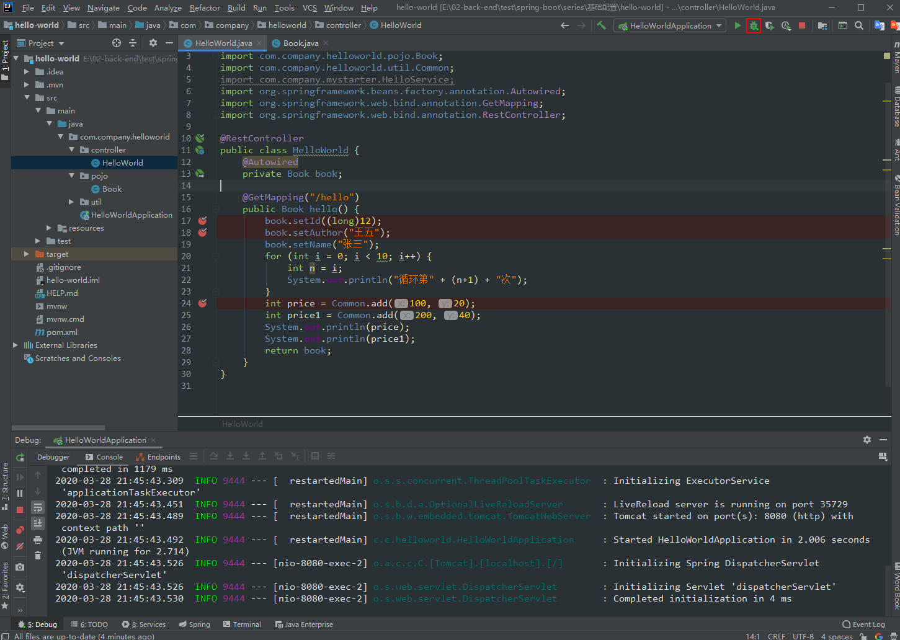
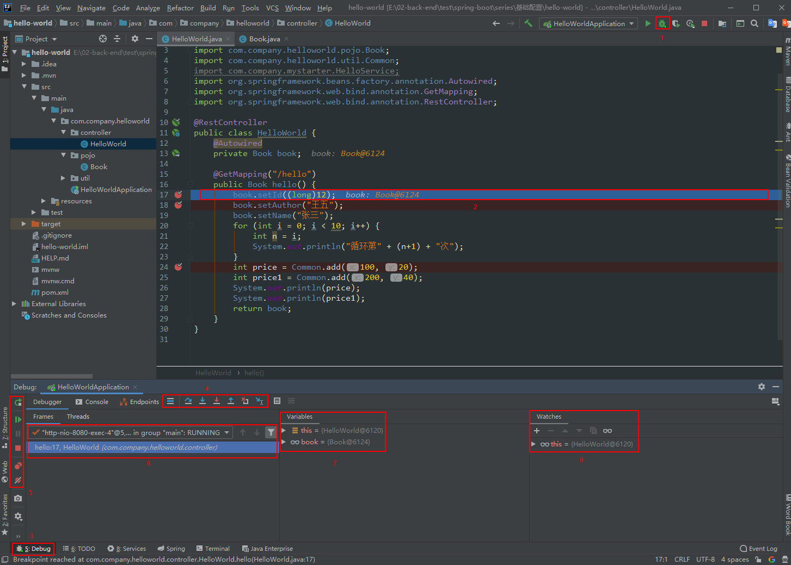
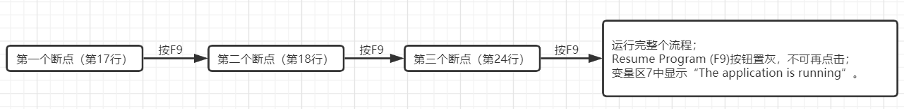

# debug使用技巧

## 1 Debug 开篇

Debug用来追踪代码的运行流程，通常在程序运行过程中出现异常，启用Debug模式可以分析定位异常发生的位置，以及在运行过程中参数的变化。如查看一个前端请求的运行流程。

点击右上角按钮，以Debug模式运行程序。

当在客户端发送请求，请求进入到断点后自动激活Debug窗口。区域2中按钮、区域5中的Resume Program按钮变成高亮状态，

图中标注的8个地方说明：

1. 以Debug模式启动服务，左边的一个按钮则是以Run模式启动。在开发中，我一般会直接启动Debug模式，方便随时调试代码。

2. 断点：在左边行号栏单击左键，或者快捷键Ctrl+F8 打上/取消断点，断点行的颜色可自己去设置。

3. Debug窗口：访问请求到达第一个断点后，会自动激活Debug窗口。如果没有自动激活，可以去设置里设置，如图1.2。

4. 调试按钮：一共有8个按钮，调试的主要功能就对应着这几个按钮，鼠标悬停在按钮上可以查看对应的快捷键。在菜单栏Run里可以找到同样的对应的功能，如图1.4。

5. 服务按钮：可以在这里关闭/启动服务，设置断点等。

6. 方法调用栈：这里显示了该线程调试所经过的所有方法，勾选右上角的[Show All Frames]按钮，就不会显示其它类库的方法了，否则这里会有一大堆的方法。

7. Variables：在变量区可以查看当前断点之前的当前方法内的变量。

9. Watches：查看变量，可以将Variables区中的变量拖到Watches中查看

## 2 基本用法

Debug调试的功能主要对应着图一中4和5两组按钮：

4中按钮：

- Show Execution Point (Alt + F10)：如果你的光标在其它行或其它页面，点击这个按钮可跳转到当前代码执行的行。

- Step Over (F8)：步过，一行一行地往下走，如果这一行上有方法不会进入方法。比如这行代码

  `Int a = add(x, y);`

  如果只想知道add方法返回的结果，而不关注方法体内的具体细节，可以点击Step Over；如果想查看方法体内具体的执行细节，可以执行下面的步入。

- Step Into (F7)：步入，如果当前行有方法，可以进入方法内部，一般用于进入自定义方法内，不会进入官方类库的方法。

- Force Step Into (Alt + Shift + F7)：强制步入，跟步入作用类似，只是能进入任何方法，查看底层源码的时候可以用这个进入官方类库的方法。

- Step Out (Shift + F8)：步出，跟步入相反，从步入的方法内退出到方法调用处，此时方法已执行完毕，只是还没有完成赋值。

- Drop Frame (默认无)：回退断点，后面章节详细说明。

- Run to Cursor (Alt + F9)：运行到光标处，你可以将光标定位到你需要查看的那一行，然后使用这个功能，代码会运行至光标行，而不需要打断点。

  如果感觉Step Over一行一行的执行太慢，可以使用Run to Cursor，Step Over 是一行行执行，而Run to Cursor可以直接运行到指定光标所再的行。当指定的光标前还有断点没执行到，那么先执行这些断点处。

- Evaluate Expression (Alt + F8)：计算表达式，后面章节详细说明。

5中按钮：

- Rerun 'xxxx'：重新运行程序，会关闭服务后重新启动程序。
- Resume Program (F9)：恢复程序，比如上图例子中有3个断点，分别在17、18、24行，当前运行至第17行，按F9，则运行到下一个断点(即第18行)，再按F9，运行到第24行，再按F9，则运行完整个流程，因为后面已经没有断点了。

  

  既然想要恢复程序，就得把所有相关的断点都执行到。当一个请求的流程走完后，变量区会提示“The application is running”，此时Resume Program按钮会变成灰色。

