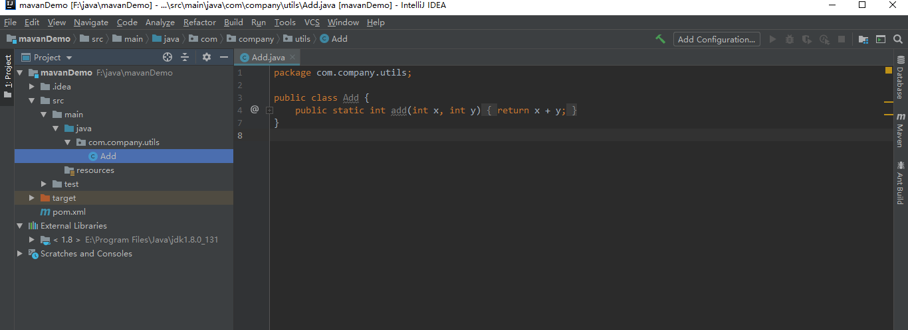
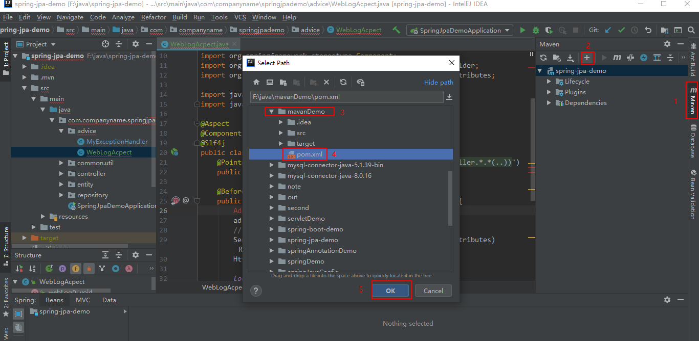
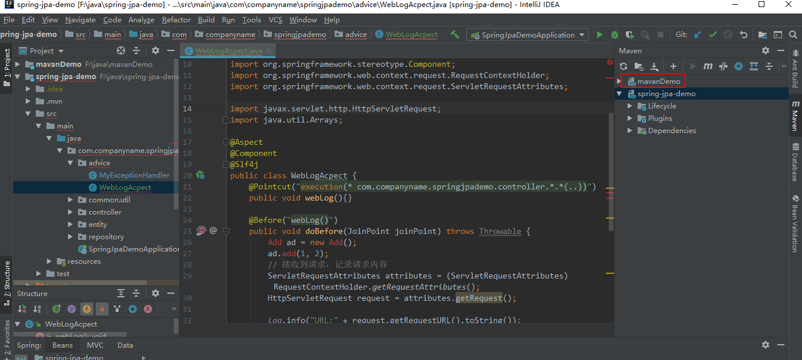
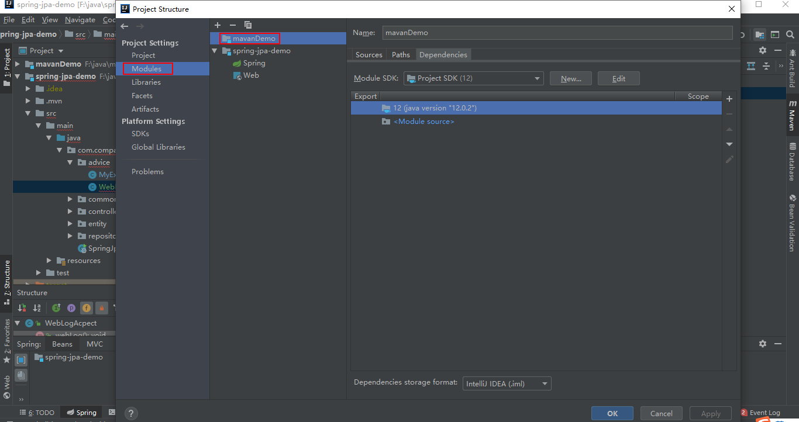
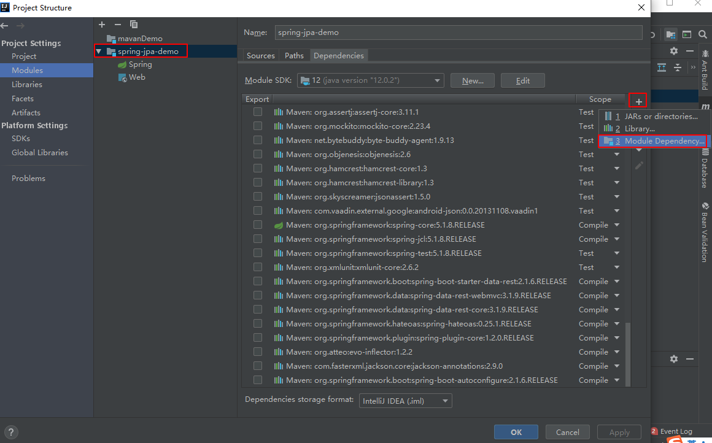
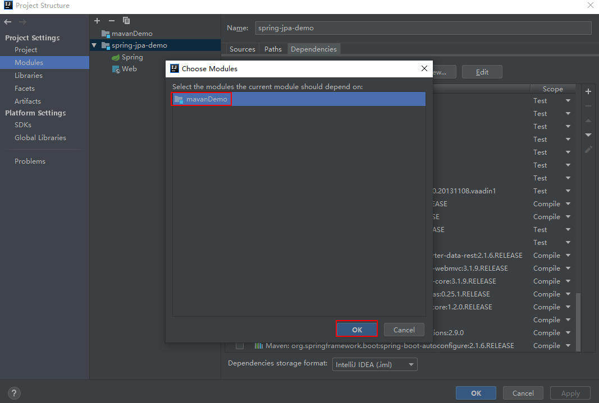
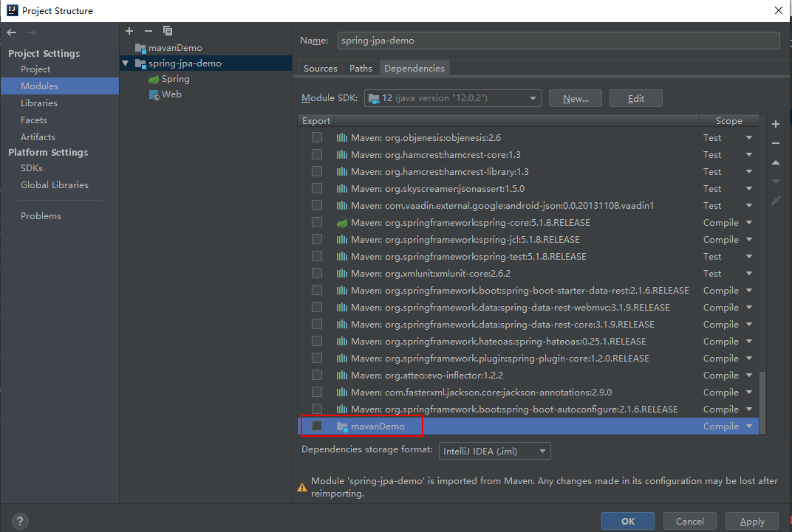
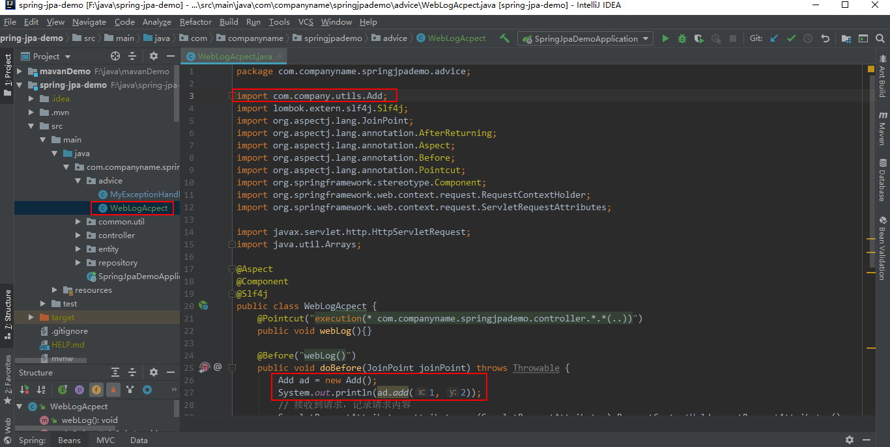

# 一个项目依赖另一个项目

一个项目要运行起来，classpath中除了有项目源码生成的编译文件、JDK、各种依赖包，可能还依赖其他项目，那么在一个项目中如何添加依赖的另一个项目呢

项目mavenDemo中类Add.java内容如下

现在项目spring-jpa-demo用到了项目mavenDemo中Add.java静态方法add，即项目spring-jpa-demo依赖项目mavenDemo。

此时发现maven管理中多了项目mavenDemo，Project Structure - Project Settings - Modules下多了项目mavenDemo，其实添加依赖项目也可以在Project Structure - Project Settings - Modules中操作。↓

