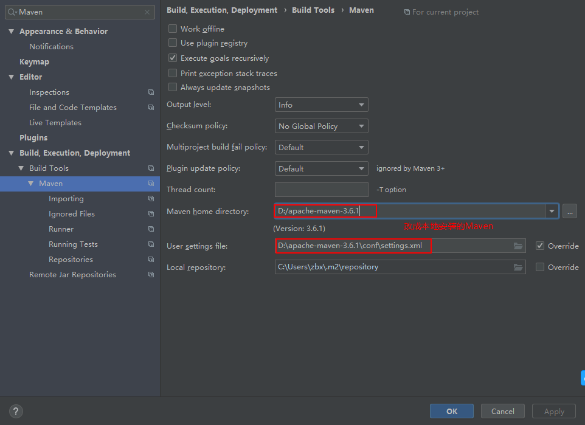

# 常用配置

1. 新建Maven项目后需要设置Maven相关
   

2. 在IDEA中使用lombok
   - 首先在idea中安装lombok插件
   - IDEA中配置，Build，Execution，Deployment-->选择Compiler-->选中Annotation Processors，然后在右侧勾选Enable annotation processing即可。
   - 在项目中引入lombok依赖

    ```xml
    <dependency>
        <groupId>org.projectlombok</groupId>
        <artifactId>lombok</artifactId>
        <version>1.18.8</version>
    </dependency>
    ```

   - 配置注解处理
    

3. 设置当一行文本过长时代码换行显示（代码其实还是一行）
   

4. 快速生成serialVersionUID
    File ➡️ Settings ➡️ Editor ➡️ Inspections
    搜索UID，然后勾选Serializable class without 'serialVersionUID'后面的复选框,右侧Severity设置为Error即可（Error不会影响编译和使用），同理另外一条
    

5. 设置注释默不显示在行首，去掉Line comment at first column、Block comment at first column前的勾选
    

6. 添加前进、后退按钮到工具栏。添加后，可以通过上下箭头调整显示的顺序
    
    

7. IDEA自动生成序列化ID
   File -> Settings -> Editor -> Inspections -> 搜索 Serialization issues ，找到 Serializable class without 'serialVersionUID' ->打上勾，Apply->OK。注意Profile应选择Default，否则每个新项目都要设置

   

   新建Java文件，例如AllTest.java

   

   即可，效果如下：

   


