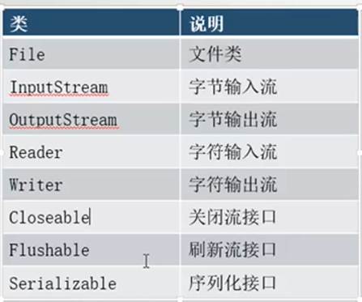
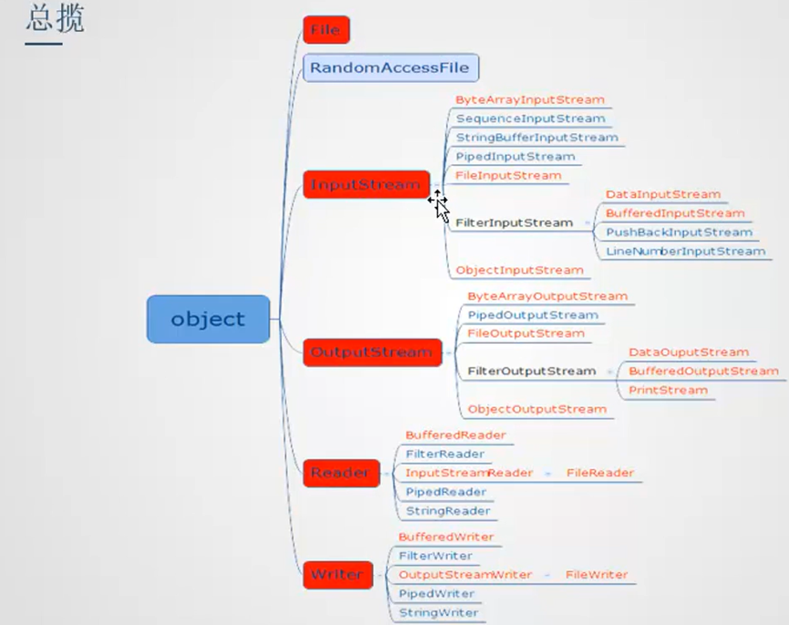
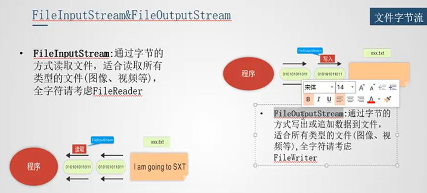

# File、IO

核心的5个类和3个接口：

java.io.File类是对文件/目录的抽象。可能存在也可能不存在。

File类关键API：

API | 说明
:-- | :--
pathSeparator, separator | 路径，路径分隔符
File(String parent, String child) File(File parent, String child) File(String name)| 构造器，没有盘符以user.dir作为相对路径，`System.out.println(System.getProperty("user.dir"));`
getName(), getPath(), getAbsolutePath(), getParent()| 获取文件名路径等
exists(), isFile(), isDirectory()| 判断状态
length()| 文件长度
createNewFile(), delete()| 创建文件，删除文件
mkdir(), mkdirs()| 创建目录
list()| 下级名称（注意时名称，而不是路径），仅包含下级文件或目录，不包含子孙级
listFiles()| 下级File
listRoots| 根目录

IO操作标准步骤：

- 创建源
- 选择流
- 操作
- 释放资源

如果用搬家公司搬家来类比，上述步骤可以用类比成：

- 要搬哪个房子
- 选择搬家车辆
- 开始搬
- 给搬家公司付款结账

流类及其子类（红色字体表示的流要重点关注）：

