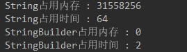

# String和BufferBuilder

String 类是不可改变的，所以你一旦创建了 String 对象，那它的值就无法改变了。如果需要对字符串做很多修改，那么应该选择使用 StringBuffer & StringBuilder 类。

```java
public class TestString2 {
    public static void main(String[] args) {
        //编译器做了优化,直接在编译的时候将字符串进行拼接
        String str1 = "hello" + " java";//相当于str1 = "hello java";
        String str2 = "hello java";
        System.out.println(str1 == str2);//true
        String str3 = "hello";
        String str4 = " java";
        //编译的时候不知道变量中存储的是什么,所以没办法在编译的时候优化
        String str5 = str3 + str4;
        System.out.println(str2 == str5);//false
    }
}
```

```java
public class Test {
    public static void main(String[] args) {
        /**使用String进行字符串的拼接*/
        String str8 = "";
        //本质上使用StringBuilder拼接, 但是每次循环都会生成一个StringBuilder对象
        long num1 = Runtime.getRuntime().freeMemory();//获取系统剩余内存空间
        long time1 = System.currentTimeMillis();//获取系统的当前时间
        for (int i = 0; i < 5000; i++) {
            str8 = str8 + i;//相当于产生了10000个对象
        }
        long num2 = Runtime.getRuntime().freeMemory();
        long time2 = System.currentTimeMillis();
        System.out.println("String占用内存 : " + (num1 - num2));
        System.out.println("String占用时间 : " + (time2 - time1));
        /**使用StringBuilder进行字符串的拼接*/
        StringBuilder sb1 = new StringBuilder("");
        long num3 = Runtime.getRuntime().freeMemory();
        long time3 = System.currentTimeMillis();
        for (int i = 0; i < 5000; i++) {
            sb1.append(i);
        }
        long num4 = Runtime.getRuntime().freeMemory();
        long time4 = System.currentTimeMillis();
        System.out.println("StringBuilder占用内存 : " + (num3 - num4));
        System.out.println("StringBuilder占用时间 : " + (time4 - time3));
    }
}
```


