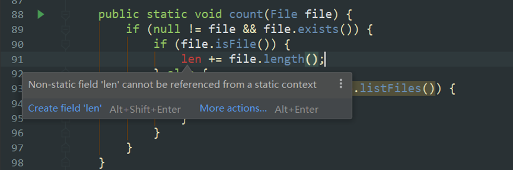
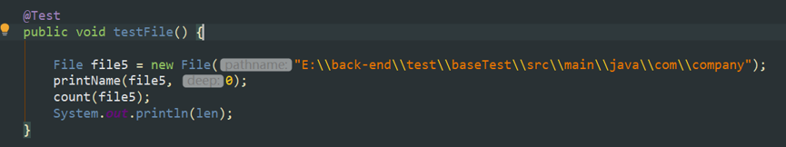

# static

[java中静态代码块的用法 static用法详解](https://www.cnblogs.com/luoyanli/archive/2012/12/04/2800758.html)

静态方法中不能用this和super关键字，不能直接访问所属类的实例变量和实例方法(就是不带static的成员变量和成员成员方法)，只能访问所属类的静态成员变量和成员方法。

非静态方法中可以使用类变量。

