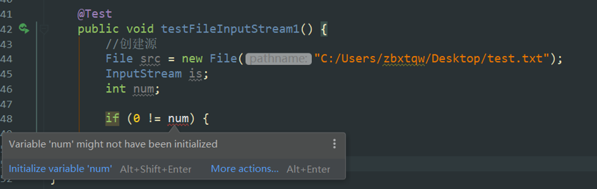

# 三种变量类型

- 方法局部变量：在方法、构造方法或者语句块中定义的变量被称为方法局部变量。变量声明和初始化都是在方法中，方法结束后，变量就会自动销毁。***方法局部变量在使用前需要初始化，否则报如下错误***

- 类成员变量（实例变量）：类成员变量是定义在类中，方法体之外的变量。这种变量在创建对象的时候实例化。类成员变量可以被类中方法、构造方法和特定类的语句块访问。***声明时如果没有初始化，会初始化为默认值。数值类型的默认值为0，String类型默认值为空字符串，布尔类型为false，数组类型为null，其他对象类型为null***

- 类变量（静态变量）：类变量也声明在类中，方法体之外，但必须声明为static类型，也有默认值，同类成员变量。

