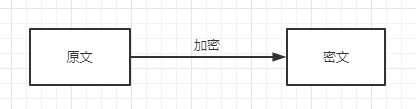

# 消息摘要算法

[Hutool-crypto概述](https://www.hutool.cn/docs/#/crypto/%E6%91%98%E8%A6%81%E5%8A%A0%E5%AF%86-Digester%E5%92%8CHMac)

消息摘要（Message Digest）又称为数字摘要(Digital Digest)。

它是一个唯一对应一个消息或文本的固定长度的值，它由一个单向Hash加密函数对消息进行作用而产生。HASH函数的抗冲突性使得如果一段明文稍有变化，哪怕只更改该段落的一个字母，通过哈希算法作用后都将产生不同的值。而HASH算法的单向性使得要找到哈希值相同的两个不同的输入消息，在计算上是不可能的。所以数据的哈希值，即消息摘要，可以检验数据的完整性。 

无论用户输入什么长度的原始数据，经过计算后输出的密文都是固定长度的。

用大白话来说，任何一段数据应该都和人一样是唯一的，唯一的标识是什么，人类的话目前就是指纹，而数据的指纹是什么呢？没错，就是消息摘要算法产生的这一段String。比如我们在注册网站的时候，客户端向服务器传输的，应该是我们输入的密码进行消息摘要处理后的内容，这样就算服务器被攻破，Hack也无法知道用户真实的密码是什么。

常见的HASH算法有MD5、SHA。

