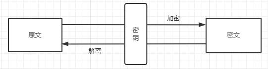

# 对称加密

[对称加密-SymmetricCrypto](https://www.hutool.cn/docs/#/crypto/%E5%AF%B9%E7%A7%B0%E5%8A%A0%E5%AF%86-SymmetricCrypto)

采用单钥密码系统的加密方法，同一个密钥可以同时用作信息的加密和解密，这种加密方法称为对称加密，也称为单密钥加密。而因为加密和解密都使用同一个密钥，如何把密钥安全地传递到解密者手上就成了必须要解决的问题。当然，安全性较低带来的优点就是优计算量小、加密速度快、加密效率高。 
然并卵，现代计算机对这种级别的计算量早就不care了，安全才是最重要的。

