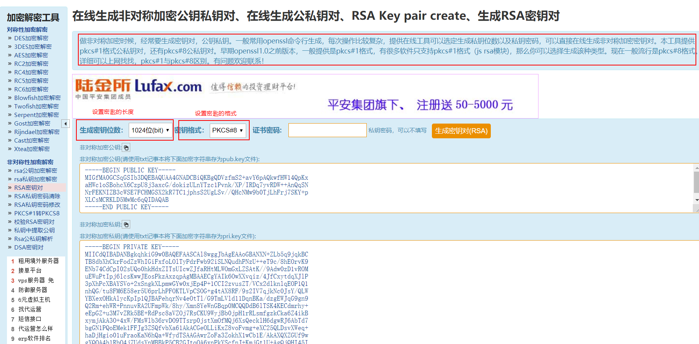

# RSA

[在线生成公私钥](http://web.chacuo.net/netrsakeypair)

RSA，常说的非对称加密。加密解密密钥不一致，它们是成对出现，本工具密钥生成是PEM格式。公钥加密的私钥解密，私钥加密的要公钥解密。往往私钥是不公开的，公钥是大家共享的。相同内容，相同私钥每次加密后结果还会不一样。

## 1 JAVA

```java
package com.company.hutool.crypto;

import cn.hutool.core.util.CharsetUtil;
import cn.hutool.core.util.HexUtil;
import cn.hutool.core.util.StrUtil;
import cn.hutool.crypto.asymmetric.KeyType;
import cn.hutool.crypto.asymmetric.RSA;

public class AsymmetricCrypto {
    public static void main(String[] args) {
        //当使用无参构造方法时，Hutool将自动生成随机的公钥私钥密钥对
        RSA rsa = new RSA();

        //System.out.println("1: " + rsa.getPrivateKey());
        System.out.println("2: " + rsa.getPrivateKeyBase64()); //每次执行的结果不一样

        //公钥加密，
        byte[] encrypt = rsa.encrypt(StrUtil.bytes("123456", CharsetUtil.CHARSET_UTF_8), KeyType.PublicKey);
        System.out.println("加密后的内容：" + HexUtil.encodeHexStr(encrypt));

        //私钥解密
        byte[] decrypt = rsa.decrypt(encrypt, KeyType.PrivateKey);
        System.out.println(StrUtil.str(decrypt, CharsetUtil.CHARSET_UTF_8));
    }
}
```

已知私钥和密文，如何解密密文:

```java
package com.company.hutool.crypto;

import cn.hutool.core.util.CharsetUtil;
import cn.hutool.core.util.HexUtil;
import cn.hutool.core.util.StrUtil;
import cn.hutool.crypto.SecureUtil;
import cn.hutool.crypto.asymmetric.KeyType;
import cn.hutool.crypto.asymmetric.RSA;

import java.security.KeyPair;

public class AsymmetricCrypto3 {
    public static void main(String[] args) {
        //私钥
        String PRIVATE_KEY = "MIICdgIBADANBgkqhkiG9w0BAQEFAASCAmAwggJcAgEAAoGBAJy0NCr7fsbRFkQIYBccZY2Jaa2I9Bn2AfpsBhoUwwgiyUDx7GogNoPdN3LcWqBVIuvG/Kqj9svzASdF5s8RIElqstHMZrmWqD2E6LAvgFDm124TpEAi8J/jWjTBoUsKOZF8EItuPPzA7xIbcCdQiWCeuqOGFgLQFURUVyPGBY03AgMBAAECgYAkDXmrIe2LBHPg9yRUbN4YcDL2D/pJNsZBvTSyL3CnoIk4/e/sgrjIIc8uB/B5ztyX7lIXWF3hkmkDhhuSLFiG73GEfbpBxPZZzdpYrn7D0CoxZPBMiCICpqfHtU9anrf8Ir6TBGMrPOwdTKWVT6/kABNL/6q3pCbhCf/AgDRCsQJBAMljAIyzs+9dqrIG4M6xhBrOIJeFFWRy41uldDbxRkSbumAnM93i7Ba7vbfD68WrqIZCScllW3kWfY0yxYs7lXsCQQDHMyizRoE8Qe99ALxQaoU7/d3iPCQdfjLS+xq2XzPnFnCu3UHqxoeDDzIl4/TSqgrQmHjtTdE6Sv06yQzEo/R1AkBgfPa+czs67H3kXjdH0PWigjBLaJAfWIxmVJeh22f3Z0Wc3CuVnCvRmJIFgfFs/Bn6ebgwrkdtdMEi7biIRTwRAkBQh1AG2ZPZRlaI1ElMwSNHk2Ol1+ZJvgDR5g1weKBE5X98UZoaTVPvGa+OPc91cqSYm2sXlAPnavVgVHLC8/0ZAkEAtB1J/FMy9S089MBvA848ozxmpTVG/AD2T+04C12bfXyTDaf6d3GzKU15xNeEzS8juKdhNbAzCz236gQdOxaqOw==";

        RSA rsa = new RSA(PRIVATE_KEY, null);

        //密文
        String a = "7c6974279abadaff7bdfbb9bd870d1844942006e881439783dbcb95acdde9c6f93505c2cd208362fccaf0c7b69deb157763b3cea12eadda75006c79899ee9f9094fad1a0d42183dcb1a6adba08708bfbd1c7833a7a842ddf9b48562f25f18a0807b81a070e9f0a9b7750183d1203cb64ccb84bbf073a8d5b9fc8d4be79ea949f";

        //解密
        String password = new String(rsa.decrypt(a, KeyType.PrivateKey));
        System.out.println(password);
    }
}
```

```java
package com.company.hutool.crypto;

import cn.hutool.crypto.asymmetric.KeyType;
import cn.hutool.crypto.asymmetric.RSA;

public class AsymmetricCrypto4 {
    private final String publicKdy = "MFwwDQYJKoZIhvcNAQEBBQADSwAwSAJBANL378k3RiZHWx5AfJqdH9xRNBmD9wGD\n" +
            "2iRe41HdTNF8RUhNnHit5NpMNtGL0NPTSSpPjjI1kJfVorRvaQerUgkCAwEAAQ==";

    private final String privateKey = "MIIBUwIBADANBgkqhkiG9w0BAQEFAASCAT0wggE5AgEAAkEA0vfvyTdGJkdbHkB8\n" +
            "mp0f3FE0GYP3AYPaJF7jUd1M0XxFSE2ceK3k2kw20YvQ09NJKk+OMjWQl9WitG9p\n" +
            "B6tSCQIDAQABAkA2SimBrWC2/wvauBuYqjCFwLvYiRYqZKThUS3MZlebXJiLB+Ue\n" +
            "/gUifAAKIg1avttUZsHBHrop4qfJCwAI0+YRAiEA+W3NK/RaXtnRqmoUUkb59zsZ\n" +
            "UBLpvZgQPfj1MhyHDz0CIQDYhsAhPJ3mgS64NbUZmGWuuNKp5coY2GIj/zYDMJp6\n" +
            "vQIgUueLFXv/eZ1ekgz2Oi67MNCk5jeTF2BurZqNLR3MSmUCIFT3Q6uHMtsB9Eha\n" +
            "4u7hS31tj1UWE+D+ADzp59MGnoftAiBeHT7gDMuqeJHPL4b+kC+gzV4FGTfhR9q3\n" +
            "tTbklZkD2A==";

    private RSA rsa;

    //构造一个RSA对象
    public AsymmetricCrypto4() {
        this.rsa = new RSA(privateKey, publicKdy);
    }

    //公钥加密
    public String encrypt(String source) {
        return rsa.encryptStr(source, KeyType.PublicKey);
    }

    //私钥解密
    public String decrypt(String crypt) {
        return rsa.decryptStr(crypt, KeyType.PrivateKey);
    }

    //测试
    public static void main(String[] args) {
        AsymmetricCrypto4 asymmetricCrypto4 = new AsymmetricCrypto4();
        String crypt = asymmetricCrypto4.encrypt("123456");
        System.out.println(crypt); //C38BB752755B129D3FEB453FAA2FF80CECFEC2855D60BE0E079126D5C6348BC77E1549D60981AE1E805052ADE800AE75FF7CB13C7135358A47831E74D8331EEF
        System.out.println(asymmetricCrypto4.decrypt(crypt)); //123456
    }
}
```

## 2 JavaScript

[JSEncrypt](http://travistidwell.com/jsencrypt/)

## 3 Linux

[OpenSSL 介绍和使用](https://www.jianshu.com/p/fb2ae3dc7986)

[RSA加密异常：java.security.InvalidKeyException: IOException : algid parse error, not a sequence，处理方法](https://blog.csdn.net/mu_wangyue/article/details/85071354)

[openssl生成RSA格式，并转为pkcs8格式](https://www.cnblogs.com/niaowo/p/4757616.html)

步骤1：生成私钥：

`openssl genrsa -out private_key.pem 1024`

- openssl genrsa：生成私钥的命令
- -out private_key.pem：将生成的私钥保存至文件中
- 1024：指定生成私钥的大小，默认是512

步骤2：根据私钥生成公钥：

`openssl rsa -in private_key.pem -pubout -out public_key.pem`

- openssl rsa 命令
- -in filename：指明私钥文件
- -out filename：指明将提取出的公钥保存至指定文件中 
- -pubout：根据私钥提取出公钥

步骤3：将步骤1产生的私钥转换为pkcs#8格式

如果直接将步骤一产生的私钥（不含注释部分）复制粘贴到之前的例子中，会报如下异常：

`java.security.InvalidKeyException: IOException : algid parse error, not a sequence`

原因是私钥的格式不对。通过如下步骤将其转换为pkcs#8格式

`openssl pkcs8 -topk8 -inform PEM -in private_key.pem -outform PEM -nocrypt -out private_key_pkcs8.pem`

复制粘贴步骤2产生的公钥、步骤3产生的私钥（注意，不包含注释部分，即-------xxx-------）至上面的例子中即可使用。

## 4 在线快速生成密匙对

做非对称加密时候，经常要生成密钥对，公钥私钥。一般常用openssl命令行生成，每次操作比较复杂，提供在线工具可以选定生成私钥位数以及私钥密码，可以直接在线生成非对称加密密钥对。本工具提供pkcs#1格式公私钥对，还有pkcs#8公私钥对。早期openssl1.0之前版本，一般提供是pkcs#1格式，有很多软件只支持pkcs#1格式（js rsa模块)，那么你可以选择生成该种类型。现在一般流行是pkcs#8格式。

[在线生成公私钥](http://web.chacuo.net/netrsakeypair)

