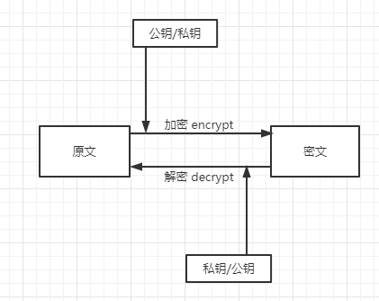

# 非对称加密

[非对称加密-AsymmetricCrypto](https://www.hutool.cn/docs/#/crypto/%E9%9D%9E%E5%AF%B9%E7%A7%B0%E5%8A%A0%E5%AF%86-AsymmetricCrypto)

非对称加密算法需要两个密钥来进行加密和解密，分别是公钥和私钥。需要注意的一点，这个公钥和私钥必须是一对的，如果用公钥对数据进行加密，那么只有使用对应的私钥才能解密，反之亦然。由于加密和解密使用的是两个不同的密钥，因此，这种算法叫做非对称加密算法。

常用的非对称加密是RSA和DSA。

