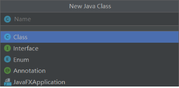
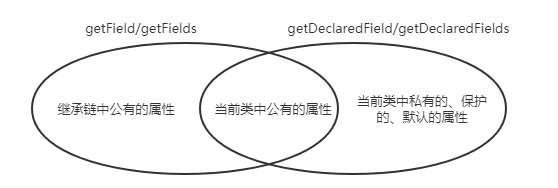
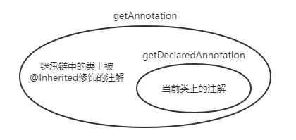

# 反射

[访问注解（annotation）的几种常见方法](https://www.cnblogs.com/alice-cj/p/10388624.html)

<!-- 在eladmin项目中， -->

Java 是一种面向对象的语言，任何事物都可以抽象成类，包括“类”本身：

- 将 Java 中“类”本身抽象成`java.lang.Class`类
- “属性”抽象成`java.lang.reflect.Field`类
- “方法”抽象成`java.lang.reflect.Method`类
- “构造方法”抽象成`java.lang.reflect.Constructor`类
- “注解”抽象成`java.lang.annotation.Annotation`接口

类的定义包含，访问修饰符、类名、位于哪个包下、类体（包括属性、方法、构造方法），通过Class类型对象，可以得到类声明中的任何部分，如Field、Method、Constructor、Annotation类型对象等

```java
[修饰符列表] class 类名{
	//...
}
```

## 1 获得类相关的方法

| 方法            | 用途             |
| :-------------- | :--------------- |
| getName()       | 返回类的全限定名 |
| getSimpleName() | 返回类名         |
| getPackage()    | 获得类的包       |
| newInstance()   | 创建类的实例     |

## 2 获得类中属性相关的方法

| 方法                          | 用途                                                           |
| :---------------------------- | :------------------------------------------------------------- |
| getField(String name)         | 获得某个**公有**的属性对象（**可以是继承的**）                 |
| getFields()                   | 获得所有**公有**的属性对象（**可以是继承的**）                 |
| getDeclaredField(String name) | 获取类**本身**的某个属性成员（**包括私有、公有、保护、默认**） |
| getDeclaredFields()           | 获取类**本身**的所有属性成员（**包括私有、公有、保护、默认**） |

getField获得某个公有的属性对象，注意这里是公有属性(public)，如果在当前类中找不到指定名称的属性，就会去父类（或父接口）中找，如果父类（或父接口）中没有，继续沿着继承链查找，直到找到为止，否则报异常NoSuchFieldException。

**getField 和 getDeclaredFiled 区别：**

- getField 仅能获取类(及其父类) public属性成员
- getDeclaredFiled 仅能获取类本身的属性成员（包括私有、共有、保护） 

getMethod 和 getDeclaredMethod、getConstructor 和 getDeclaredConstructor的区别跟这类似。

## 3 获得类中方法相关的方法

| 方法                                                         | 用途                                                   |
| :----------------------------------------------------------- | :----------------------------------------------------- |
| `getMethod(String name, Class<?>... parameterTypes)`         | 获得该类某个**公有**的方法（**可以是继承的**）         |
| `getMethods()`                                               | 获得该类所有**公有**的方法（**可以是继承的**）         |
| `getDeclaredMethod(String name, Class<?>... parameterTypes)` | 获取类本身的某个方法（**包括私有、公有、保护、默认**） |
| `getDeclaredMethods()`                                       | 获取类本身的所有方法（**包括私有、公有、保护、默认**） |

## 4 获得类中构造器相关的方法

| 方法                                               | 用途                                                           |
| :------------------------------------------------- | :------------------------------------------------------------- |
| getConstructor(Class...<?> parameterTypes)         | 获取某个**公有**的构造方法（**可以是继承的**）                 |
| getConstructors()                                  | 获得所有**公有**的构造方法（**可以是继承的**）                 |
| getDeclaredConstructor(Class...<?> parameterTypes) | 获取类**本身**的某个构造方法（**包括私有、公有、保护、默认**） |
| getDeclaredConstructors()                          | 获取类本身的所有构造方法（**包括私有、公有、保护、默认**）     |

## 5 获得类中注解相关的方法

因为类、属性、方法等都可以被注解修饰，因此Class、Field、Method等对象都实现了AnnotatedElement接口，这些类的实例都具有如下方法

| 方法                                                                       | 用途                                                                                                               |
| :------------------------------------------------------------------------- | :----------------------------------------------------------------------------------------------------------------- |
| `<T extends Annotation> T getAnnotation(Class<T> annotationClass)`         | 获取类上的某个注解，如果该类有父类，并且在该类上没找到该注解，可以继续在父类上查找（前提是该注解被@Inherited修饰） |
| `Annotation[] getAnnotations()`                                            | 跟上面相似，获取类上所有的注解                                                                                     |
| `<T extends Annotation> T getDeclaredAnnotation(Class<T> annotationClass)` | 获取直接存在于此类上的注解                                                                                         |
| `Annotation[] getDeclaredAnnotations()`                                    | 获取直接存在于此类上的所有的注解                                                                                   |

## 6 类中其他重要的方法

| 方法                                                             | 用途                          |
| :--------------------------------------------------------------- | :---------------------------- |
| isInterface()                                                    | 判断该Class实例是否是接口类型 |
| isEnum()                                                         | 判断该Class实例是否是枚举类型 |
| isAnnotation()                                                   | 判断该Class实例是否是注解类型 |
| isAnonymousClass()                                               | 判断是否是匿名类              |
| **isAnnotationPresent(Class<? extends Annotation> annotationClass)** | **判断类上是否有某个注解**    |
| isArray()                                                        | 如果是一个数组类则返回true    |
| isInstance(Object obj)                                           | 如果obj是该类的实例则返回true |
| isLocalClass()                                                   | 如果是局部类则返回true        |
| isMemberClass()                                                  | 如果是内部类则返回true        |

IDEA中，在某个包下右键，点击新建Java Class，会弹出下面的会话框。`java.lang.Class`不仅可以表示“类”，还可以表示“接口”、“枚举”、“注解”，分别对接上表中的前几个方法。



## 7 关于几对方法区别的说明

- getField 和 getDeclaredFiled
- getMethod 和 getDeclaredMethod
- getConstructor 和 getDeclaredConstructor

上面这些区别类似，不带“Declared”的方法，强调是公有的属性或方法，**不管是当前类或者是从父类继承的**；带“Declared”的方法，强调从**当前类**获取私有、共有、保护、默认的属性或方法



- getAnnotation 和 getDeclaredAnnotation

getAnnotation 表示 **当前类**有的注解，或者从**父类**中继承的注解(被@Inherited修饰的)；getDeclaredAnnotation 表示**当前类**上存在的注解。


