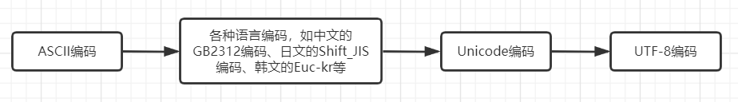

# 字符集

[字符编码](https://www.liaoxuefeng.com/wiki/1016959663602400/1017075323632896)

## 1 关于数字

不管是用二进制还是八进制、十进制、十六进制形式呈现，其表示的数值大小是一样的。如“一年有12个月”，这里的12是用十进制表示的，这段话也可以描述成“一年有0xc个月”，这里的0xc是16进制。

即一个数可以用不同的进制来表示，但不管用什么进制来表示，表示的都是同一个数。就好比某人有乳名、小名、姓名，不管用哪个名字称呼，都是指这个人。

## 2 关于编码

在计算机中，所有的数据在存储和运算时都要使用二进制数表示（因为计算机用高电平和低电平分别表示1和0），例如，像a、b、c、d这样的52个字母（包括大写）以及0、1、2等数字还有一些常用的符号（例如*、#、@等）在计算机中存储时也要使用二进制数来表示，而具体用哪个二进制数字表示哪个字符，当然每个人都可以约定自己的一套（这就叫编码），而大家要想互相通信而不造成混乱，那么大家就必须使用相同的编码规则，于是美国有关的标准化组织就出台了ASCII编码，统一规定了上述常用符号用哪些二进制数来表示。

下面列出了ASCII的部分码表：

| Bin<br>(二进制) | Oct<br>(八进制) | Dec<br>(十进制) | Hex<br>(十六进制) |  缩写/字符   |   解释    |
| :-------------: | :-------------: | :-------------: | :---------------: | :----------: | :-------: |
|    0000 0000    |       00        |        0        |       0x00        |  NUL(null)   |  空字符   |
|    0010 0001    |       041       |       33        |       0x21        |      !       |   叹号    |
|    0011 0000    |       060       |       48        |       0x30        |      0       |   字符0   |
|    0100 0001    |      0101       |       65        |       0x41        |      A       | 大写字母A |
|    0110 0001    |      0141       |       97        |       0x61        |      a       | 小写字母a |
|    0111 1111    |      0177       |       127       |       0x7F        | DEL (delete) |   删除    |

[完整的ASCII码表](https://baike.baidu.com/item/ASCII/309296?fr=aladdin)

**注意：** 字符0的ASCII编码二进制是00110000，而不要以为是00000001，其他数字型字符（0-9）类似。

各种编码出现的时间轴：



后一个时期出现的编码是为了解决前一个时期编码的不足。

|   编码类型   | 解决的问题 | 存在的不足 |
| :----------: | :----------- | :------------ |
|  ASCII编码   | 为西文字符对应二进制数提供了一套一一对应关系 | 该编码仅仅适用于西文字符，只有127个字符  | 各种语言编码 | 解决了ASCII编码只适用于西文编码的不足 | 各国有各国的标准，就会不可避免地出现冲突，结果就是，在多语言混合的文本中，显示出来会有乱码 |
| Unicode编码  | 把所有语言都统一到一套编码里，这样就不会再有乱码问题 | 如果你写的文本基本上全部是英文的话，用Unicode编码比ASCII编码需要多一倍的存储空间，在存储和传输上就十分不划算 |
|  UTF-8编码   | 把Unicode编码转化为“可变长编码”的UTF-8编码，根据不同的数字大小编码成1-6个字节，常用的英文字母被编码成1个字节，汉字通常是3个字节，只有很生僻的字符才会被编码成4-6个字节。如果你要传输的文本包含大量英文字符，用UTF-8编码就能**节省空间** |

下面例举了字符A、中的各种编码值

字符 | ASCII | Unicode | UTF-8
:-- | :--   | :--     | :--
A   | 01000001 | 00000000 01000001 | 01000001 （16进制为41）
中  | 无       | 01001110 00101101 | 11100100 10111000 10101101 （16进制为e4b8ad）

从上面的表格还可以发现，UTF-8编码有一个额外的好处，就是ASCII编码实际上可以被看成是UTF-8编码的一部分，所以，大量只支持ASCII编码的历史遗留软件可以在UTF-8编码下继续工作。

## 3 编辑器

在计算机内存中，统一使用Unicode编码，当需要保存到硬盘或者需要传输的时候，就转换为UTF-8编码。

用记事本编辑的时候，从文件读取的UTF-8字符被转换为Unicode字符到内存里，编辑完成后，保存的时候再把Unicode转换为UTF-8保存到文件。


## 4 Java

### 4.1 查看单个字符的编码

```java
String str = "A";
byte[] bytes = str.getBytes(); // 字符串转换成byte数组
for (byte aByte : bytes) {
    System.out.println(aByte); // 打印出65
}
System.out.println(new String(bytes)) // byte数组转字符串，打印A
// System.out.println(Arrays.toString(bytes)) // 也可以通过这种方式查看数组中的值，[65]
```

### 4.2 查看多个字符（即字符串）的编码

```java
String str = "hello world";
byte[] bytes = str.getBytes();
for (byte aByte : bytes) {
    System.out.println(aByte); // 换行打印出104、101、108、108、111、32、119、111、114、108、100
}
```
### 4.3 将字符串转换成十六进制字符串

从上例可以看出，将字符串转换为byte数组，数组中每一项是一个数，这个数可以用十进制表示，也可以用二进制表示，当然也可以用十六进制表示。将byte数组中每一项用十六进制表示后再拼接起来就成了十六进制字符串。

十六进制字符串只包含0-9和a-f。

字符串长度越长，转换后得到的十六进制字符串就越长。

过程如下：

字符串 -> byte数组 -> 十六进制字符串，或者

字符串 -> 十六进制字符串

```java
import cn.hutool.core.util.HexUtil;

public class HexUtilDemo {
    public static void main(String[] args) {
        String str = "中";
        System.out.println(HexUtil.encodeHexStr(str)); // e4b8ad
    }
}
```

### 4.4 获取JVM默认字符集

Java 中，字符字节转换时，如果不提供字符集，使用默认字符集。例如，字符串和字节数组转换时，字节流和字符流转换时等。

```java
 System.out.println("defaultCharset:" + Charset.defaultCharset());
```

### 4.5 16进制Unicode字符

```java
String str = "I love \u4e2d\u6587";
System.out.println(str); // 打印I love 中文
```

