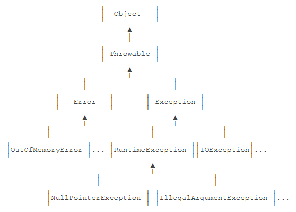
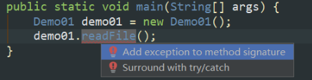

# 异常处理

异常类继承关系



## 1 检查性异常和非检查性异常

### 检查性异常

必须捕获或者向上抛出的异常，包括Exception及其子类，但不包括RuntimeException及其子类，如NumberFormatException、FileNotFoundException。对于编辑器是IDEA，如果检查性异常未捕获或者向上抛出，编辑器会爆红，如果强行执行，会编译失败不通过。

检查异常是不能通过修改代码逻辑来避免的，如FileNotFoundException，在代码层面是无法保证目标文件一定存在，即使当时存在，在日后操作中也可能将其误删。



### 非检查性异常

不需要捕获或者向上抛出的异常，包括Error及其子类，RuntimeException及其子类。如NullPointerException、IndexOutOfBoundsException。

非检查异常一般是由程序逻辑错误引起的，应该修复程序本身，如

```java
int n = Integer.parseInt(s); //可能引起NumberFormatException异常
```

但是在执行上述操作前可以先做一些判断，从而避免该异常。

## 2 try...catch...

用于捕获异常并处理

## 3 throws

声明某方法可能会产生某种异常。如果是检查性异常，该方法的调用者要么需要捕获该异常，要么继续向上抛出异常。

## 4 throw

产生一个异常

```java
public class Demo01 {
    public void readFile() throws IOException {
        File file = new File("E:\\test.txt"); // 实际并不存在文件E:\text.txt
        InputStream input = new FileInputStream(file);

    }
    public static void main(String[] args) throws IOException {
        Demo01 demo01 = new Demo01();
        demo01.readFile();
    }
}
```

执行到代码`File file = new File("E:\\test.txt");`会产生`FileNotFoundException`异常，相当于`throw new FileNotFoundException`。前者异常是运行时产生的，而后者是手动new一个异常并抛出

## 5 注意

当方法中某处代码发生异常，要么使用`try{}catch{}`包裹发生异常代码进行捕获处理，要么在方法后使用`throws Xxx`将异常抛出。

在java程序中如果异常都向外抛，直到`try{}catch{}`处捕获；如果到了主方法（main方法）仍没有捕获，
异常就由java虚拟机（java运行环境）处理。


