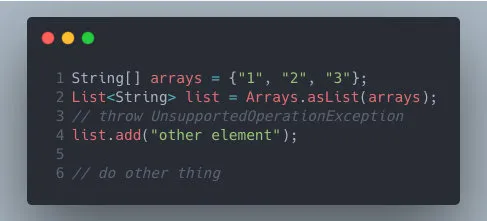
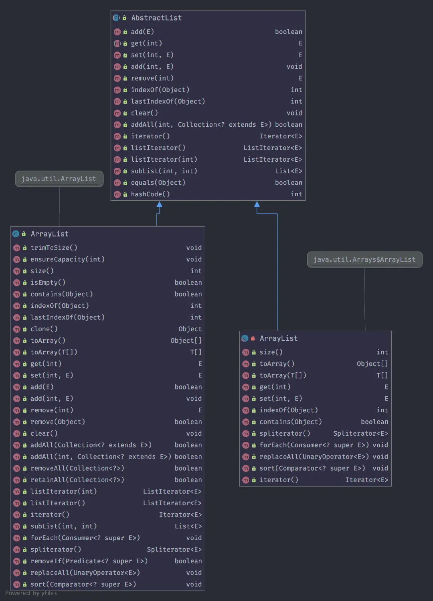
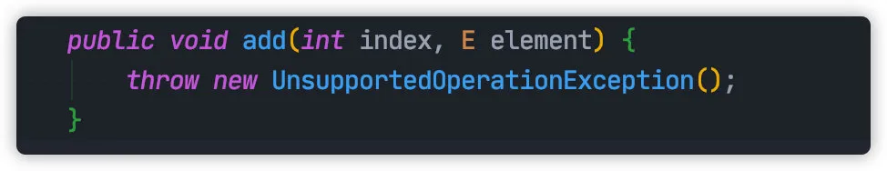
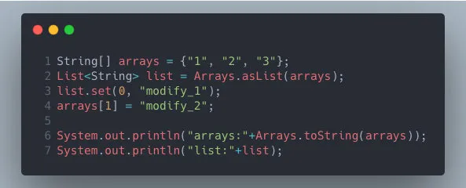
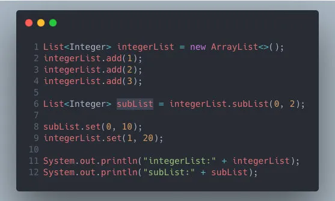
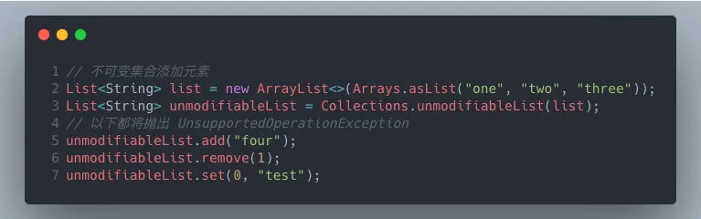
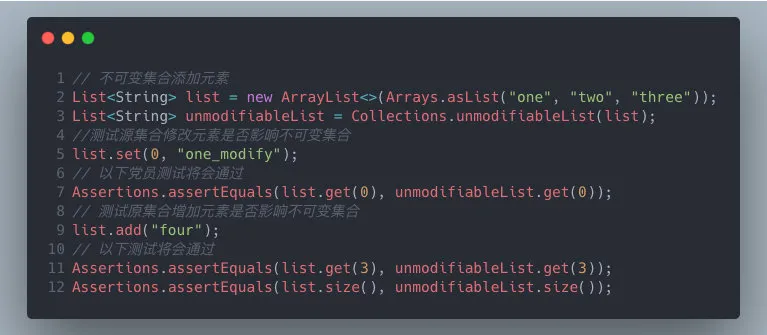
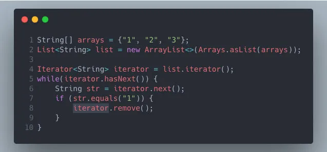
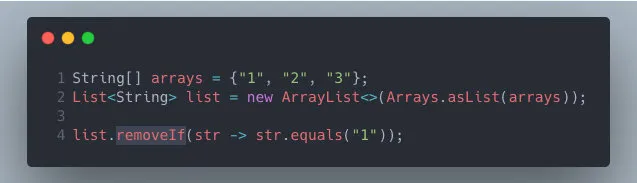

# List的坑

## 1 数组转List Arrays.asList

- 通过Arrays#asList生成的集合不支持增删元素，否则报异常UnsupportedOperationException。
- 对于修改操作，新集合和原数组会相互影响。

通过Arrays#asList 将数组转化为 List 集合。



这段代码表面看起来没有任何问题，编译也能通过，但是真正测试运行的时候将会在第 4 行抛出  UnsupportedOperationException。

Arrays#asList 返回的 ArrayList 其实是个李鬼，仅仅只是 Arrays 一个内部类，并非真正的 java.util.ArrayList。



从上图可以发现，add/remove 等方法实际都继承自 AbstractList类，而 java.util.Arrays$ArrayList 并没有重写父类的方法。而父类方法恰恰都会抛出 UnsupportedOperationException。



李鬼 ArrayList 除了不支持增删操作这个坑以外，还存在另外一个大坑，对于修改操作，新集合和原数组会**相互影响**。



输出结果：

```
arrays:[modify_1, modify_2, 3]
list:[modify_1, modify_2, 3]
```

修复的办法也很简单，套娃一层 ArrayList

```java
List<String> list = new ArrayList<>(Arrays.asList(arrays));
```

通过这种方式，我将新的List集合与原数组解耦，改动新集合不再影响原数组，同时由于此时还是真正的 ArrayList，不用担心 add/remove报错了。

## 2 列表切片 List.subList

List#subList 生成新集合也会与原始 List **互相影响**。



输出结果：

```java
integerList:[10, 20, 3]
subList:[10, 20]
```

这里修复的办法也很简单，跟上面一样，也来个套娃呗，加一层 ArrayList 。

## 3 不可变集合

> 原集合任何改动将会影响不可变集合

为了防止 List 集合被误操作，我们可以使用 Collections#unmodifiableList 生成一个不可变（immutable）集合，进行防御性编程。

这个不可变集合只能被读取，不能做任何修改，包括增加，删除，修改，从而保护不可变集合的安全。



但是，修改原始数组会同时**影响**不可变数组



可以使用使用 JDK9 List#of 方法来修改。

```java
List<String> list = new ArrayList<>(Arrays.asList("one", "two", "three"));
List<String> unmodifiableList = List.of(list.toArray(new String[]{}));
```

## 4 foreach删除元素

先来看一段代码：

```java
String[] arrays = {"1", "2", "3"};
List<String> list = new ArrayList<>(Arrays.asList(arrays));
for (String str : list) {
    if (str.equals("1")) {
        list.remove(str);
    }
}
```

上面的代码我们使用 foreach 方式遍历 List 集合，如果符合条件，将会从集合中删除改元素。

这个程序编译正常，但是运行时，程序将会发生异常，日志如下：

```
java.util.ConcurrentModificationException
	at java.base/java.util.ArrayList$Itr.checkForComodification(ArrayList.java:939)
	at java.base/java.util.ArrayList$Itr.next(ArrayList.java:893)
```

修复的办法有两种：

使用 Iterator#remove 删除元素



另一种是使用JDK1.8 List#removeIf （推荐）

