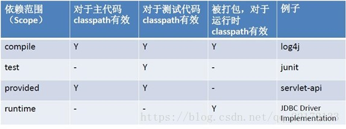

# 依赖

## 1 依赖关系

同一pom文件中的依赖覆盖：
在同一pom文件中，对于同一依赖，不同版本，下面的写的会覆盖先写的

依赖的传递性：
如果C依赖B，B依赖A（C->B->A），有时候我们明明在C项目的pom文件中只写了一个依赖B，但在Idea的External Libraries下除了B依赖，还有其他依赖A，这是因为B项目依赖了A等。如果在B项目的pom文件中将A依赖optional属性设置为true，则会阻断依赖的传递性，即此时External Libraries下只有依赖B，无依赖A，也可以通过下面的排除依赖达到同样的效果

依赖的冲突、就近使用原则：
如果C依赖B，B依赖A（C->B->A）A的pom文件中依赖来junit的4.9版本，那么B和C中都是使用了4.9版本。如果B中重新依赖junit的4.8版本，那么与通过A传递过来的依赖Junit 4.9版本发生冲突。但由于依赖的就近使用原则，B和C最终都是使用4.8版本。

## 2 可选依赖

Optional标签表示该依赖是否可选，默认是false。可以理解为，如果为true，则表示该依赖不会传递下去，如果为false，则会传递下去。

## 3 排除依赖

```xml
<!-- 部分项目C的pom文件 -->
<dependency>
    <groupId>com.itheima.maven</groupId>
    <artifactId>B</artifactId>
    <version>0.0.1-SNAPSHOT</version>
    <exclusions>
        <exclusion>
            <groupId>com.itheima.maven</groupId>
            <artifactId>A</artifactId>
        </exclusion>
    </exclusions>
</dependency>
```

exclusions标签下可以写多个exclusion，exclusion中不用写version
表示C虽然依赖于B，但是不依赖于A(B依赖于A)。即告诉maven你只依赖指定的项目，不依赖项目的依赖。

## 5 依赖范围

当依赖junit的scope标签值为test，则只有src\test\java目录下的代码能引入junit包中的类，如果在src\main\java目录下的代码中引入junit包中的类，若用的是IDEA，则会有错误提示，若是用简单编辑器编辑的，则在执行javac编辑命令时报错



- compile： 默认编译依赖范围。对于编译，测试，运行三种classpath都有效（默认）
- test：测试依赖范围。只对于测试classpath有效
- provided：已提供依赖范围。对于编译，测试的classpath都有效，但对于运行无效。因为由容器已经提供，例如servlet-api，打包时不能添加，因为- Tomcat中已经有了，会冲突
- runtime:运行时提供。例如:jdbc驱动，只有在运行时才需要

## 6 继承parent

新建一个maven项目maven-parent（创建时不勾选Create from archetype），安装到本地仓库之后。子工程会继承父工程中的依赖。

```xml
<!-- maven-parent的pom文件 -->
<!-- 注意打包方式为pom -->
<packaging>pom</packaging>

<modules>
    <module>maven-son</module>
</modules>
<!-- 集中管理依赖版本 -->
<properties>
    <lombok.version>1.18.8</lombok.version>
    <junit.version>4.12</junit.version>
</properties>

<!-- 依赖管理 -->
<dependencyManagement>
    <dependencies>
        <dependency>
            <groupId>org.projectlombok</groupId>
            <artifactId>lombok</artifactId>
            <version>${lombok.version}</version>
        </dependency>
        <dependency>
            <groupId>junit</groupId>
            <artifactId>junit</artifactId>
            <version>${junit.version}</version>
        </dependency>
    </dependencies>
</dependencyManagement>

<dependencies>
    <dependency>
        <groupId>org.projectlombok</groupId>
        <artifactId>lombok</artifactId>
    </dependency>
    <dependency>
        <groupId>junit</groupId>
        <artifactId>junit</artifactId>
    </dependency>
</dependencies>
```

```xml
<!-- maven-son的pom文件 -->
<parent>
    <groupId>com.company</groupId>
    <artifactId>maven-parent</artifactId>
    <version>1.0-SNAPSHOT</version>
</parent>
```

## 7管理依赖dependencyManagement

父工程可以使用dependencyManagement标签管理依赖，其实没有真正依赖（即父工程中实际没有引用该项目），它只是管理依赖的版本。如下：

```xml
<dependencyManagement>
    <dependencies>
        <dependency>
            <groupId>junit</groupId>
            <artifactId>junit</artifactId>
            <version>4.9</version>
        </dependency>
    </dependencies>
</dependencyManagement>
```

那么子工程中如果需要junit：

```xml
<dependencies>
    <dependency>
        <groupId>junit</groupId>
        <artifactId>junit</artifactId>
    </dependency>
</dependencies>
```

## 8 集中管理版本号

不在指定版本号。实际上父工程还可以集中管理版本号，更改如下：

```xml
<properties>
    <junit.version>4.9</junit.version>
</properties>
​
<dependencyManagement>
    <dependencies>
        <dependency>
            <groupId>junit</groupId>
            <artifactId>junit</artifactId>
            <version>${junit.version}</version>
        </dependency>
    </dependencies>
</dependencyManagement>
```


