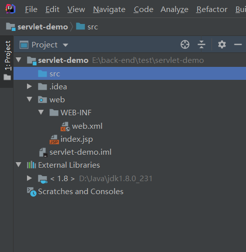
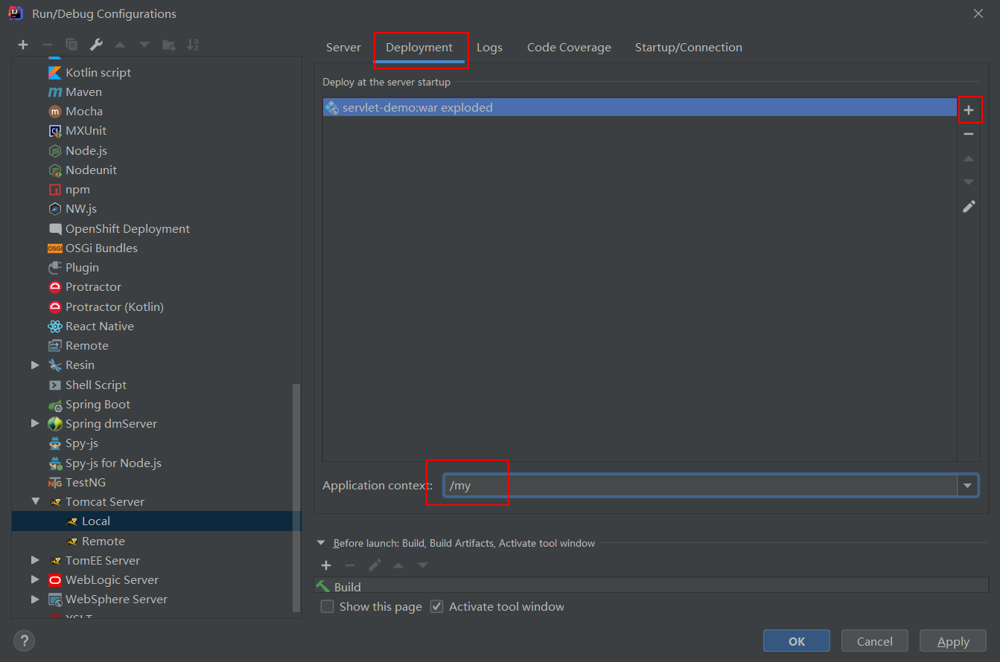

# IDEA开发Servlet

[参考](https://www.cnblogs.com/liusong-funtime/p/9144275.html)

[参考连接](https://blog.csdn.net/xn6517/article/details/49516299)，这篇文章很好的介绍了如何手动编写Servlet项目，并在Tomcat上部署。本笔记要讲的是如何用开发工具IDEA编写Servlet、通过IDEA调试预览。

用IDEA只是编写、调试Servlet项目，实际上生产，还是要用Tomcat部署。↓

这是新建项目后，项目初始的结构

在WEB-INF目录下新建classes、lib目录，classes用来存放编译后输出的classes文件，lib用于存放第三方的jar包。

设置编译后文件存放目录

添加编译（javac）java文件所需要的jar包

这里的my要跟项目将来部署时放于webapp中的文件夹名相同

此时在index.html上右键，选择"Run index.html"从而运行项目，在浏览器上输入http://localhost:8080/my/index.html 或者 http://localhost:8080/my/HelloWorldServlet?test=111查看效果

至此，用IDEA已完成开发调试Servlet项目，将servlet-demo项目下的web文件夹复制到Tomcat的webapp目录下，启动Tomcat（双击bin\startup.bat）即完成部署

可以发现lib目录下并没有servlet-api.jar，因为tomcat安装目录下lib文件夹中已经存在了该jar包

