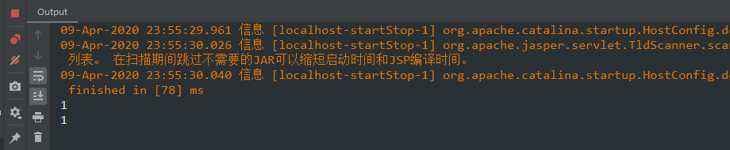
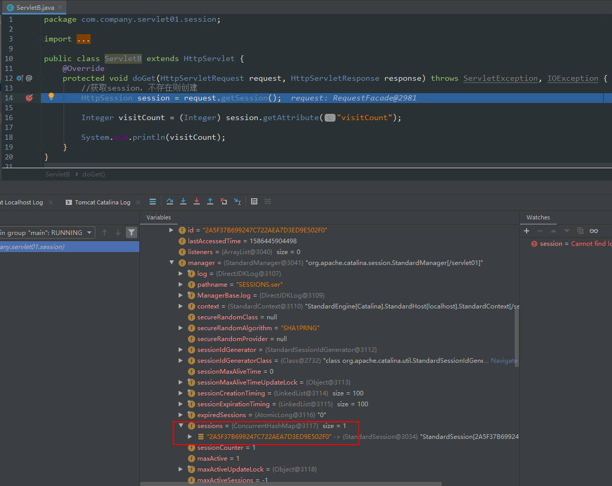
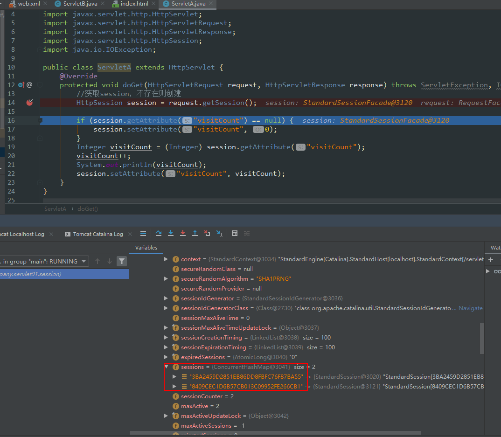

# session

当Servlet程序在Tomcat服务器运行起来后，假如Servlet程序中描述了两个Servlet实例ServletA、ServletB，对应的请求路径/servlet/a、/servlet/b，

ServletA.class

```java
package com.company.servlet01.session;

import javax.servlet.ServletException;
import javax.servlet.http.HttpServlet;
import javax.servlet.http.HttpServletRequest;
import javax.servlet.http.HttpServletResponse;
import javax.servlet.http.HttpSession;
import java.io.IOException;

public class ServletA extends HttpServlet {
    @Override
    protected void doGet(HttpServletRequest request, HttpServletResponse response) throws ServletException, IOException {
        //获取session，不存在则创建
        HttpSession session = request.getSession();

        if (session.getAttribute("visitCount") == null) {
            session.setAttribute("visitCount", 0);
        }
        Integer visitCount = (Integer) session.getAttribute("visitCount");
        visitCount++;
        System.out.println(visitCount);
        session.setAttribute("visitCount", visitCount);
    }
}
```

ServletB.class

```java
package com.company.servlet01.session;

import javax.servlet.ServletException;
import javax.servlet.http.HttpServlet;
import javax.servlet.http.HttpServletRequest;
import javax.servlet.http.HttpServletResponse;
import javax.servlet.http.HttpSession;
import java.io.IOException;

public class ServletB extends HttpServlet {
    @Override
    protected void doGet(HttpServletRequest request, HttpServletResponse response) throws ServletException, IOException {
        //获取session，不存在则创建
        HttpSession session = request.getSession();

        Integer visitCount = (Integer) session.getAttribute("visitCount");

        System.out.println(visitCount);
    }
}
```

web.xml

```xml
<?xml version="1.0" encoding="UTF-8"?>
<web-app xmlns="http://xmlns.jcp.org/xml/ns/javaee"
         xmlns:xsi="http://www.w3.org/2001/XMLSchema-instance"
         xsi:schemaLocation="http://xmlns.jcp.org/xml/ns/javaee http://xmlns.jcp.org/xml/ns/javaee/web-app_4_0.xsd"
         version="4.0">
    <servlet>
        <servlet-name>ServletA</servlet-name>
        <servlet-class>com.company.servlet01.session.ServletA</servlet-class>
    </servlet>
    <servlet-mapping>
        <servlet-name>ServletA</servlet-name>
        <url-pattern>/session/a</url-pattern>
    </servlet-mapping>

    <servlet>
        <servlet-name>ServletB</servlet-name>
        <servlet-class>com.company.servlet01.session.ServletB</servlet-class>
    </servlet>
    <servlet-mapping>
        <servlet-name>ServletB</servlet-name>
        <url-pattern>/session/b</url-pattern>
    </servlet-mapping>
</web-app>
```

运行程序，在Postman访问`http://localhost:8080/servlet01/session/a`，此时会在服务器端产生一个会话session，id为2A5F37B699247C722AEA7D3ED9E502F0。此时在Postman访问`http://localhost:8080/servlet01/session/b`，请求头会自动设置包含JSESSIONID的cookie。请后两次控制台输出结果如下：



第一次请求创建了id为2A5F37B699247C722AEA7D3ED9E502F0的session，第二次请求的请求头携带的JSESSIONID为2A5F37B699247C722AEA7D3ED9E502F0，因此两次请求对应的是同一个会话session，第二次请求可以直接使用visitCount，因为第一次请求的时候已经在session中设置了visitCount

一个请求可以使用另一个请求中创建的session，只要该请求的请求头携带对应的JSESSIONID。如何实现请求头携带对应的JSESSIONID。

- 首先确保请求是在同一个客户端中触发的，
- 若`/servlet01/session/a`是在谷歌浏览器触发的，`/servlet01/session/b`是在IE浏览器触发，即使是同一台电脑，第二个请求的请求头不会携带第一个请求产生的JSESSIONID

JSESSIONID其实就是session的id。

之前错误的想法：

两个servlet实例中都有`HttpSession session = request.getSession();`，以为每个请求都会新建一个新的session（请求/servlet01/session/a创建一个、请求/servlet01/session/b创建一个）

查看后台程序中总共有多少个session:

request -> request -> session -> manager -> sessions




在IE浏览器请求http://localhost:8080/servlet01/session/a，产生一个新的session



关闭IE浏览器，再请求http://localhost:8080/servlet01/session/a，又产生一个新的session


在谷歌浏览器请求http://localhost:8080/servlet01/session/a，产生一个新的session


关闭谷歌浏览器，再请求http://localhost:8080/servlet01/session/a，没有产生一个新的session


关闭浏览器，再次请求是否产生新的session，取决于关闭浏览器后，浏览器是否将cookie存到硬盘中了。如果关闭后浏览器的cookie存到了硬盘中，当再次打开浏览器，会从硬盘中读入存储的cookie，再次请求接口时，请求头会携带上原先的JSESSIONID，服务器认为是已经存在的会话，而不会新建会话
