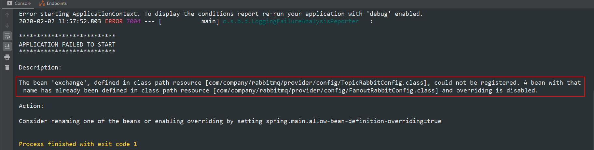

# @Configuration和@Bean的用法和理解

@Configuration可理解为用spring的时候xml里面的`<beans>`标签，@Bean可理解为用spring的时候xml里面的`<bean>`标签

**@Component、@Repository、@Service、@Controller是将自定义的、新的class实例化后放入bean容器中管理，而@Configuration和@Bean是将实例化已有的class后放入bean容器中管理**

因此在集成其他框架，如集成shiro权限框架，用@Configuration和@Bean来配置Shiro

```java
@Configuration
public class JdbcConfign {

    @Value("com.mysql.jdbc.Driver")
    private String driverClassName;

    @Value("jdbc://xxxx.xx.xxx/xx")
    private String driverUrl;

    @Value("${root}")
    private String driverUsername;

    @Value("123456")
    private String driverPassword;

    @Bean(name = "dataSource")
    public DataSource dataSource() { // 这里可以单独写成一个方法，也可以将内容写在下面的jdbcTemplate方法中
        BasicDataSource dataSource = new BasicDataSource(); // 定义一个用于返回的对象
        dataSource.setDriverClassName(driverClassName);
        dataSource.setUrl(driverUrl);
        dataSource.setUsername(driverUsername);
        dataSource.setPassword(driverPassword);
        return dataSource; // 最终返回对象
    }

    @Bean
    public JdbcTemplate jdbcTemplate() {
        return new JdbcTemplate(dataSource()); // 在同一个config文件中通过调用方法dataSource得到DataSource实例，在外部bean class 中可以通过@Autowired自动注入
    }

}
```

这样在项目中如下使用，这个jdbcTemplate就是我们在JdbcConfign中配的DataSource

```java
@Autowired
private JdbcTemplate jdbcTemplate;
```

注意：一个SpingBoot项目中可能有多个配置类，不同配置类中各个`@Bean`修饰的方法名称不能相同（除非`@Bean`中定义了name属性），否则将报如下错误



## @Bean修饰的方法参数的注入方式

方法参数默认注入方式为Autowired，即先根据类型匹配，若有多个在根据名称进行匹配。

```java
@Configuration
@PropertySource("classpath:db.properties")
public class SpringConfiguration {
    @Bean
    public static PropertySourcesPlaceholderConfigurer propertySourcesPlaceholderConfigurer() {
        return new PropertySourcesPlaceholderConfigurer();
    }

    @Bean(name = "dataSource")
    public DataSource dataSource(@Value("${jdbc.driverClass}") String driverClassName,
        @Value("${jdbc.jdbcUrl}") String url, @Value("${jdbc.user}") String username,
        @Value("${jdbc.password}") String password) {
        DriverManagerDataSource dataSource = new DriverManagerDataSource();
        dataSource.setDriverClassName(driverClassName);
        dataSource.setUrl(url);
        dataSource.setUsername(username);
        dataSource.setPassword(password);
        return dataSource;
    }
    @Bean(name = "jdbcTemplate")
    public JdbcTemplate jdbcTemplate(@Qualifier(value = "dataSource") DataSource dataSource) {
        return new JdbcTemplate(dataSource);
    }
}
```