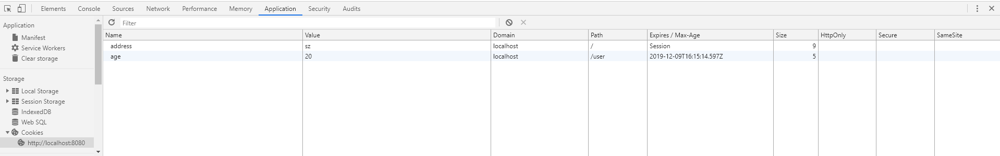

# Cookie 和 Session

## 背景

http请求是无状态的，即两次请求是不关联的

Session是由Web服务器端(Tomcat)维护的，Cookie是由客户端维护的

## Cookie

Cookie 存储在客户端(浏览器)，如下图。在图中（即浏览器上）可以修改Name，Value，Domain，path，Expires/Max-age



Cookie 可以在浏览器侧通过Javascript创建/修改/删除（如上），也可以服务器侧创建/修改/删除。如果服务器侧创建了Cookie，当浏览器请求了服务器后，浏览器会保存Cookie，当浏览器下次请求时，会在请求头中自动携带Cookie信息

```java
@RequestMapping(value = "/setCookies",method = RequestMethod.GET)
public String setCookies(HttpServeletResponse response, HttpServeletRequest request) {
    // Cookie nameCookie=new Cookie("name", "zhangsan");
    // cookie.setMaxAge(3600);
    // Cookie ageCookie=new Cookie("age", "20");
    // response.addCookie(nameCookie);
    // response.addCookie(ageCookie);
    // return "获得cookies信息成功";

    Cookie[] cookies = request.getCookies();
    if (null != cookies) {
        for (Cookie cookie : cookies) {
            System.out.println(cookie.getName() + "-" + cookie.getValue());
        }
    }
}
```

```java
//注解方式获取cookie中对应的key值
@RequestMapping("/testCookieValue")
public String testCookieValue(@CookieValue("name") String name ) {
    //前提是已经创建了或者已经存在cookie了，那么下面这个就直接把对应的key值拿出来了。
    System.out.println("testCookieValue, name=" + name);
    return "SUCCESS";
}
```

Cookie 生命周期：

- 如果maxAge属性为正数，则表示该Cookie会在maxAge秒之后自动失效。浏览器会将maxAge为正数的Cookie持久化，即写到对应的Cookie文件中。无论客户关闭了浏览器还是电脑，只要还在maxAge秒之前，登录网站时该Cookie仍然有效。

- 如果maxAge为负数，则表示该Cookie仅在本浏览器窗口以及本窗口打开的子窗口内有效，关闭窗口后该Cookie即失效。maxAge为负数的Cookie，为临时性Cookie，不会被持久化，不会被写到Cookie文件中。Cookie信息保存在浏览器内存中，因此关闭浏览器该Cookie就消失了。Cookie默认的maxAge值为–1。

- 如果maxAge为0，则表示删除该Cookie。Cookie机制没有提供删除Cookie的方法，因此通过设置该Cookie即时失效实现删除Cookie的效果。失效的Cookie会被浏览器从Cookie文件或者内存中删除

- 若不设置过期时间，则表示这个cookie的生命期为浏览器会话期间，关闭浏览器窗口，cookie就消失。这种生命期为浏览器会话期的cookie被称为会话cookie。会话cookie一般不存储在硬盘上而是保存在内存里

只要Cookie还在生命周期内，关闭浏览器再重新打开（或者关机后在打开浏览器），访问相应的url，浏览器会自动在请求头携带cookie信息

## Session
