# Spring Boot 注解

[参考](https://mp.weixin.qq.com/s?__biz=MzUyNDkzNzczNQ==&mid=2247487618&idx=1&sn=ddf498107744e81e558a699d9d5eb9b0&scene=19#wechat_redirect)

## 1 Spring Web MVC 注解

### 1.1 @RequestMapping

@RequestMapping注解的主要用途是将Web请求与请求处理类中的方法进行映射。Spring MVC和Spring WebFlux都通过RquestMappingHandlerMapping和RequestMappingHndlerAdapter两个类来提供对@RequestMapping注解的支持。

@RequestMapping注解对请求处理类中的请求处理方法进行标注；@RequestMapping注解拥有以下的六个配置属性：

- value:映射的请求URL或者其别名
- method:兼容HTTP的方法名
- params:根据HTTP参数的存在、缺省或值对请求进行过滤
- header:根据HTTP Header的存在、缺省或值对请求进行过滤
- consume:设定在HTTP请求正文中允许使用的媒体类型
- product:在HTTP响应体中允许使用的媒体类型

> 提示：在使用@RequestMapping之前，请求处理类还需要使用@Controller或@RestController进行标记

下面是使用@RequestMapping的两个示例：

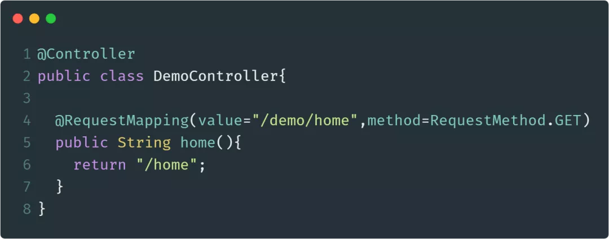

@RequestMapping还可以对类进行标记，这样类中的处理方法在映射请求路径时，会自动将类上@RequestMapping设置的value拼接到方法中映射路径之前，如下：


### 1.2 @RequestBody

@RequestBody在处理请求方法的参数列表中使用，它可以将请求主体中的参数绑定到一个对象中，请求主体参数是通过HttpMessageConverter传递的，根据请求主体中的参数名与对象的属性名进行匹配并绑定值。此外，还可以通过@Valid注解对请求主体中的参数进行校验。下面是一个使用@RequestBody的示例：

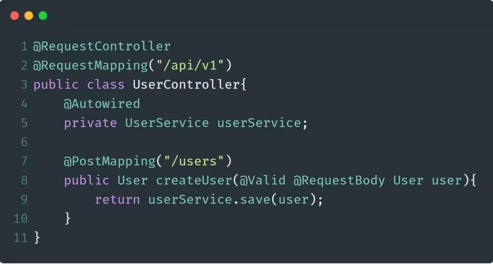

### 1.3 @GetMapping

@GetMapping注解用于处理HTTP GET请求，并将请求映射到具体的处理方法中。具体来说，@GetMapping是一个组合注解，它相当于是@RequestMapping(method=RequestMethod.GET)的快捷方式。下面是@GetMapping的一个使用示例：

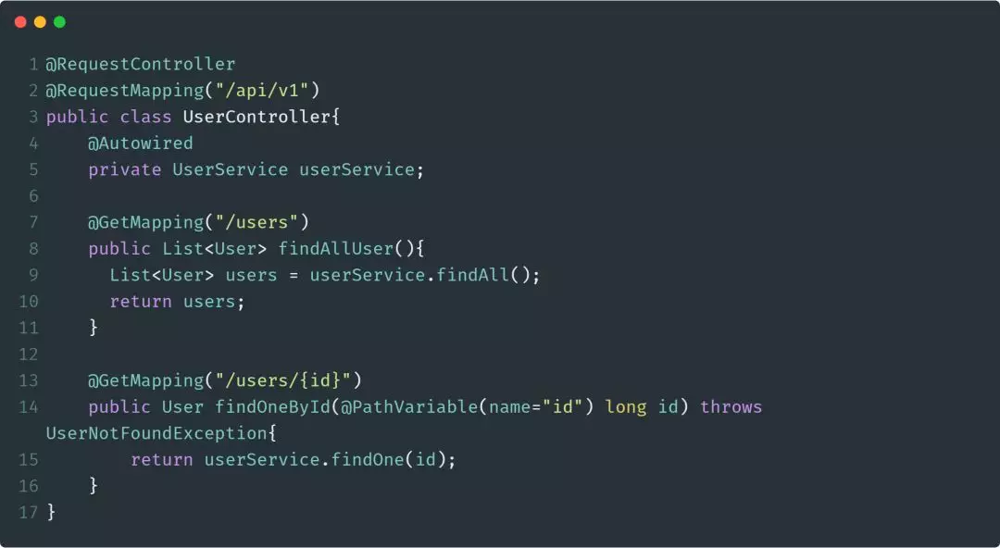

### 1.4 @PostMapping

@PostMapping注解用于处理HTTP POST请求，并将请求映射到具体的处理方法中。@PostMapping与@GetMapping一样，也是一个组合注解，它相当于是@RequestMapping(method=HttpMethod.POST)的快捷方式。下面是使用@PostMapping的一个示例：


### 1.5 @PutMapping

@PutMapping注解用于处理HTTP PUT请求，并将请求映射到具体的处理方法中，@PutMapping是一个组合注解，相当于是@RequestMapping(method=HttpMethod.PUT)的快捷方式。下面是使用@PutMapping的一个示例：

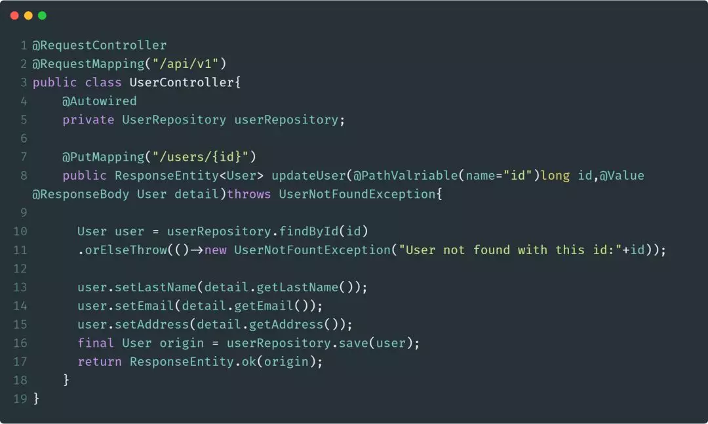

### 1.6 @DeleteMapping

@DeleteMapping注解用于处理HTTP DELETE请求，并将请求映射到删除方法中。@DeleteMapping是一个组合注解，它相当于是@RequestMapping(method=HttpMethod.DELETE)的快捷方式。下面是使用@DeleteMapping的一个示例：

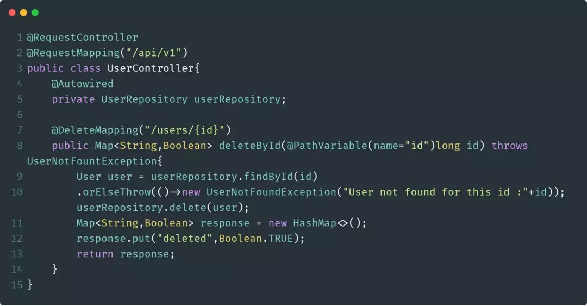

### 1.7 @PatchMapping

@PatchMapping注解用于处理HTTP PATCH请求，并将请求映射到对应的处理方法中。@PatchMapping相当于是@RequestMapping(method=HttpMethod.PATCH)的快捷方式。下面是一个简单的示例：

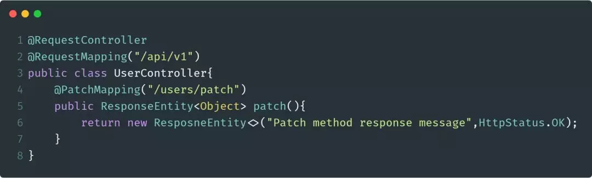

### 1.8 @ControllerAdvice

@ControllerAdvice是@Component注解的一个延伸注解，Spring会自动扫描并检测被@ControllerAdvice所标注的类。@ControllerAdvice需要和@ExceptionHandler、@InitBinder以及@ModelAttribute注解搭配使用，主要是用来处理控制器所抛出的异常信息。首先，我们需要定义一个被@ControllerAdvice所标注的类，在该类中，定义一个用于处理具体异常的方法，并使用@ExceptionHandler注解进行标记。

此外，在有必要的时候，可以使用@InitBinder在类中进行全局的配置，还可以使用@ModelAttribute配置与视图相关的参数。使用@ControllerAdvice注解，就可以快速的创建统一的，自定义的异常处理类。下面是一个使用@ControllerAdvice的示例代码：

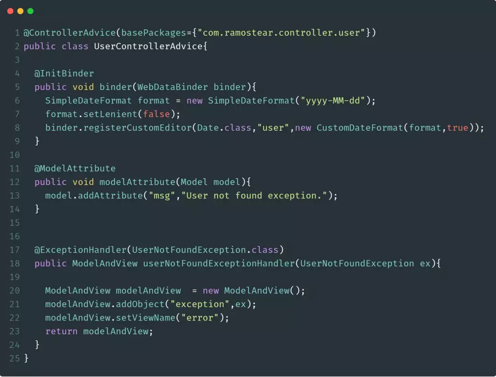

### 1.9 @ResponseBody

@ResponseBody会自动将控制器中方法的返回值写入到HTTP响应中。特别的，@ResponseBody注解只能用在被@Controller注解标记的类中。如果在被@RestController(查看源码可以发现@RestController被@ResponseBody注解着)标记的类中，则方法不需要使用@ResponseBody注解进行标注。@RestController相当于是@Controller和@ResponseBody的组合注解。下面是使用该注解的一个示例：


### 1.10 @ExceptionHandler

@ExceptionHander注解用于标注处理特定类型异常类所抛出异常的方法。当控制器中的方法抛出异常时，Spring会自动捕获异常，并将捕获的异常信息传递给被@ExceptionHandler标注的方法。下面是使用该注解的一个示例：

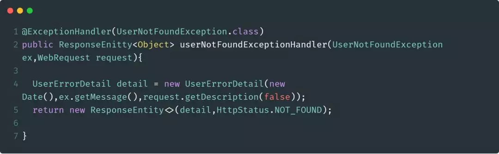

### 1.11 @ResponseStatus

@ResponseStatus注解可以标注请求处理方法。使用此注解，可以指定响应所需要的HTTP STATUS。特别地，我们可以使用HttpStauts类对该注解的value属性进行赋值。下面是使用@ResponseStatus注解的一个示例：

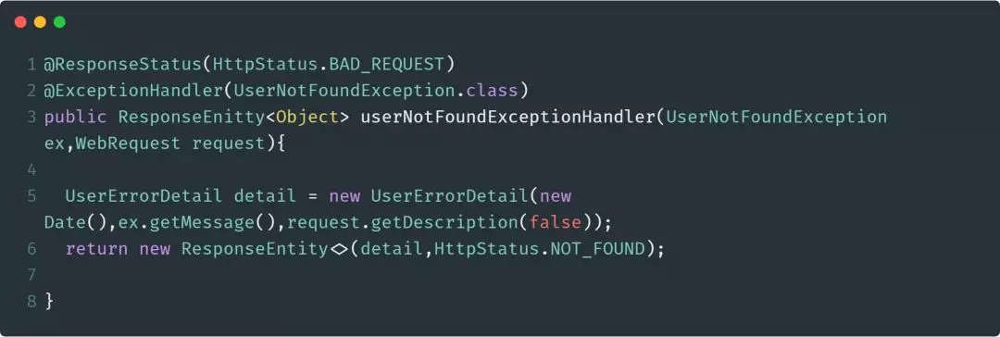

### 1.12 @PathVariable

@PathVariable注解是将方法中的参数绑定到请求URL路径变量上。@PathVariable注解允许我们使用value或name属性来给参数取一个别名。下面是使用此注解的一个示例：

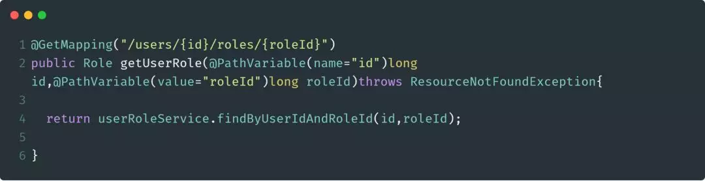

模板变量名需要使用“{ }”进行包裹，如果方法的参数名与URI模板变量名一致，则在@PathVariable中就可以省略别名的定义。下面是一个简写的示例：

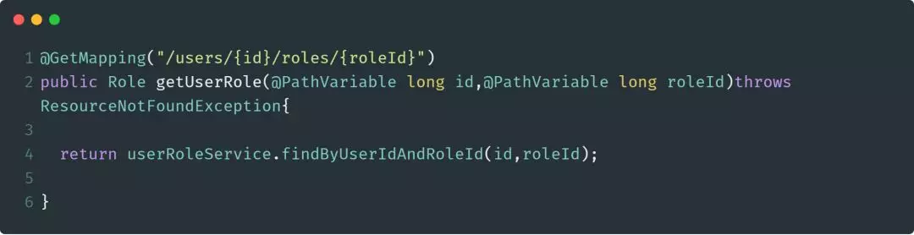

>提示：如果参数是一个非必须的，可选的项，则可以在@PathVariable中设置require = false

### 1.13 @RequestParam

用于将方法的参数与请求参数进行绑定。使用@RequestParam可以轻松的访问HTTP请求参数的值。下面是使用该注解的代码示例：

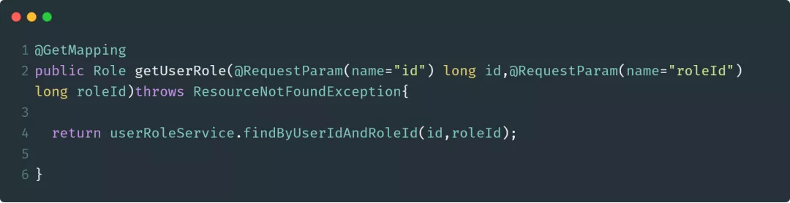

该注解的其他属性配置与@PathVariable的配置相同，特别的，如果传递的参数为空，还可以通过defaultValue设置一个默认值。示例代码如下：

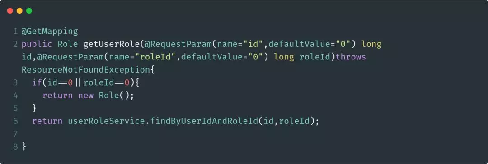

访问的url例子：`http://localhost:8000/user?id=1&roleId=2`

一旦我们在方法中定义了@RequestParam变量，如果访问的URL中不带有相应的参数，就会抛出异常——这是显然的，Spring尝试帮我们进行绑定，然而没有成功。但有的时候，参数确实不一定永远都存在，这是我们可以通过定义required属性：

`@RequestParam(name="id",required=false)`

若方法中的参数名和请求参数名一致，可以省略@RequestParam

### 1.14 @Controller

@Controller是@Component注解的一个延伸，Spring会自动扫描并配置被该注解标注的类。此注解用于标注Spring MVC的控制器。下面是使用此注解的示例代码：

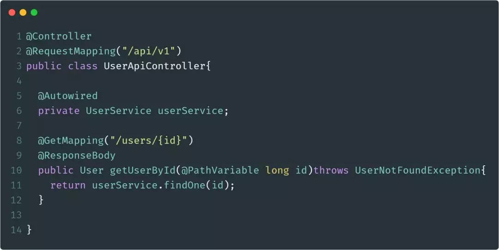

### 1.15 @RestController

@RestController是在Spring 4.0开始引入的，这是一个特定的控制器注解。此注解相当于@Controller和@ResponseBody的快捷方式。当使用此注解时，不需要再在方法上使用@ResponseBody注解。下面是使用此注解的示例代码：

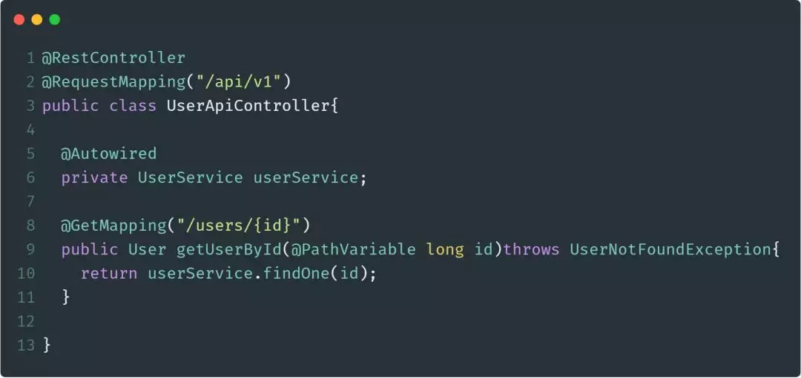

### 1.16 @ModelAttribute

通过此注解，可以通过模型索引名称来访问已经存在于控制器中的model。下面是使用此注解的一个简单示例：

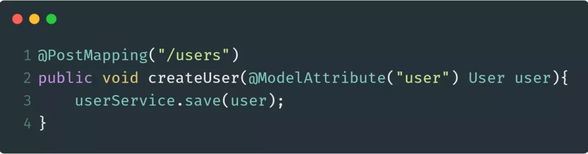

与@PathVariable和@RequestParam注解一样，如果参数名与模型具有相同的名字，则不必指定索引名称，简写示例如下：

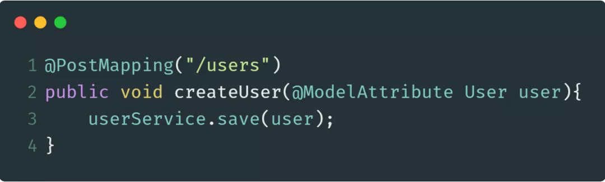

特别地，如果使用@ModelAttribute对方法进行标注，Spring会将方法的返回值绑定到具体的Model上。示例如下：

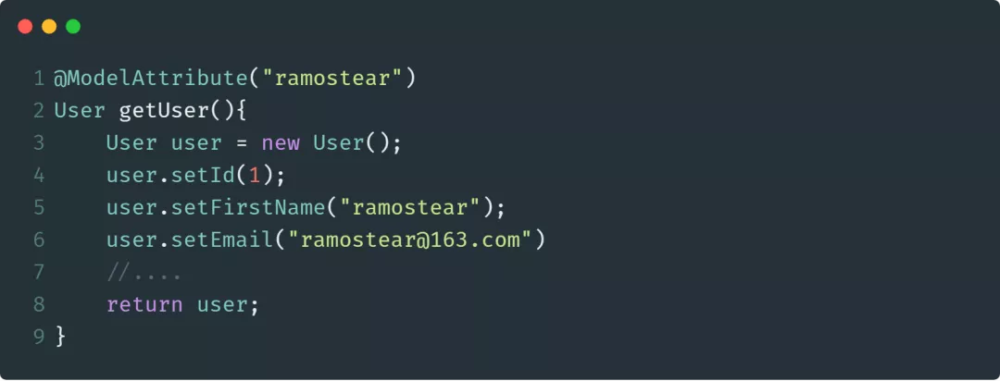

在Spring调用具体的处理方法之前，被@ModelAttribute注解标注的所有方法都将被执行。（希望更加系统的学习springboot，可以在Java知音公众号内回复“Springboot聚合”，获取springboot教程）

### 1.17 @CrossOrigin

@CrossOrigin注解将为请求处理类或请求处理方法提供跨域调用支持。如果我们将此注解标注类，那么类中的所有方法都将获得支持跨域的能力。使用此注解的好处是可以微调跨域行为。使用此注解的示例如下：

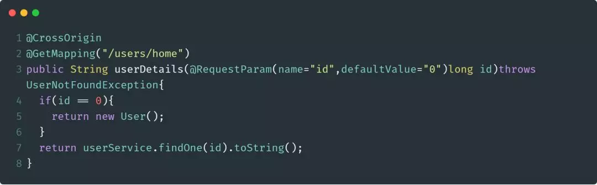

### 1.18 @InitBinder

@InitBinder注解用于标注初始化WebDataBinider的方法，该方法用于对Http请求传递的表单数据进行处理，如时间格式化、字符串处理等。下面是使用此注解的示例：


## 2 Spring Bean 注解

### 2.1 @ComponentScan

@ComponentScan注解用于配置Spring需要扫描的被组件注解注释的类所在的包。可以通过配置其basePackages属性或者value属性来配置需要扫描的包路径。value属性是basePackages的别名。此注解的用法如下：

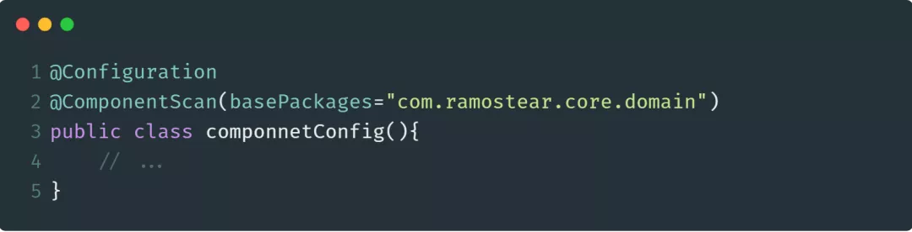

### 2.2 @Component

@Component注解用于标注一个普通的组件类，它没有明确的业务范围，只是通知Spring被此注解的类需要被纳入到Spring Bean容器中并进行管理。此注解的使用示例如下：

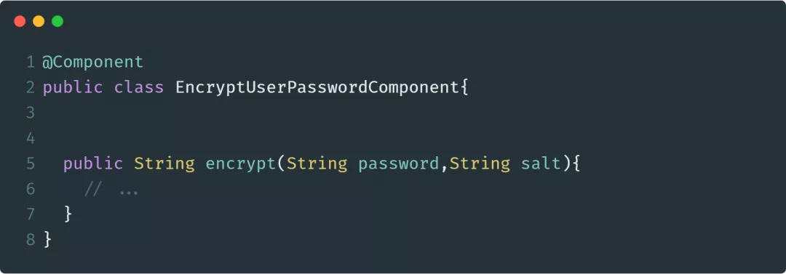

### 2.4 @Service

@Service注解是@Component的一个延伸（特例），它用于标注业务逻辑类。与@Component注解一样，被此注解标注的类，会自动被Spring所管理。下面是使用@Service注解的示例：

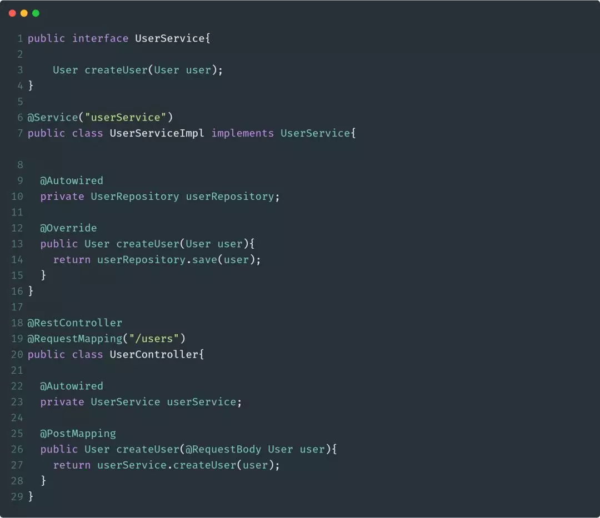

### 2.5 @Repository

@Repository注解也是@Component注解的延伸，与@Component注解一样，被此注解标注的类会被Spring自动管理起来，@Repository注解用于标注DAO层的数据持久化类。此注解的用法如下：

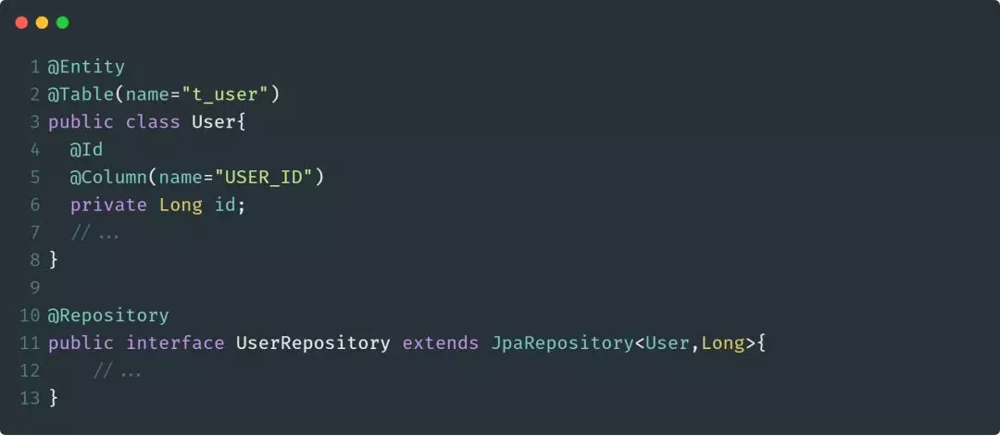

## 3 Spring Dependency Inject 注解

### 3.1 @DependsOn

@DependsOn注解可以配置Spring IoC容器在初始化一个Bean之前，先初始化其他的Bean对象。下面是此注解使用示例代码：

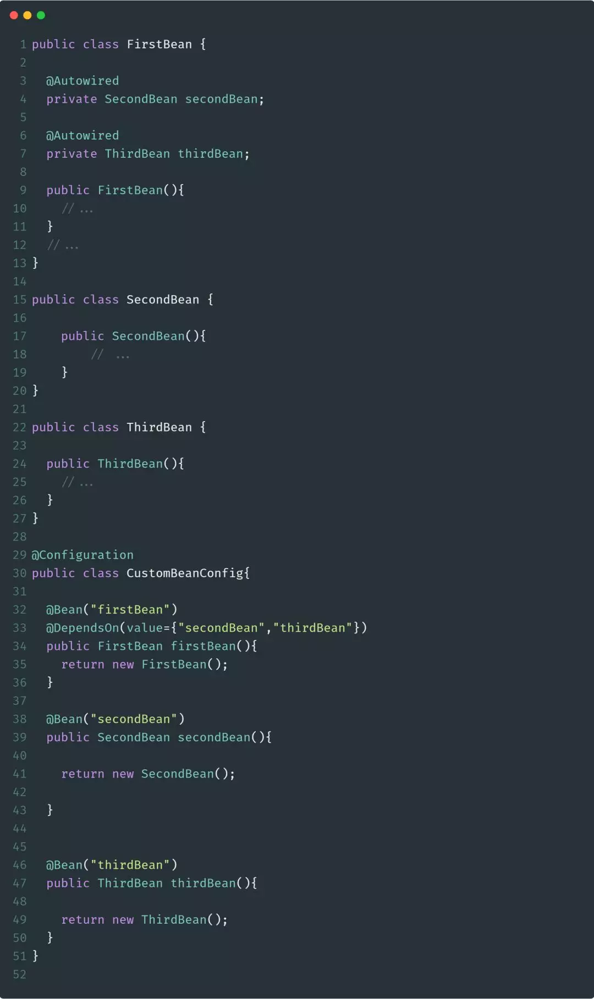

### 3.2 @Bean

@Bean注解主要的作用是告知Spring，被此注解所标注的类将需要纳入到Bean管理工厂中。@Bean注解的用法很简单，在这里，着重介绍@Bean注解中initMethod和destroyMethod的用法。示例如下：


## 4 Bean Scops注解

### 4.1 @Scope

@Scope注解可以用来定义@Component标注的类的作用范围以及@Bean所标记的类的作用范围。@Scope所限定的作用范围有：singleton、prototype、request、session、globalSession或者其他的自定义范围。（希望更加系统的学习springboot，可以在Java知音公众号内回复“Springboot聚合”，获取springboot教程）

这里以prototype为例子进行讲解。当一个Spring Bean被声明为prototype（原型模式）时，在每次需要使用到该类的时候，Spring IoC容器都会初始化一个新的改类的实例。在定义一个Bean时，可以设置Bean的scope属性为prototype：scope=“prototype”,也可以使用@Scope注解设置，如下：

`@Scope(value=ConfigurableBeanFactory.SCOPE_PROPTOTYPE)`

下面将给出两种不同的方式来使用@Scope注解，示例代码如下：

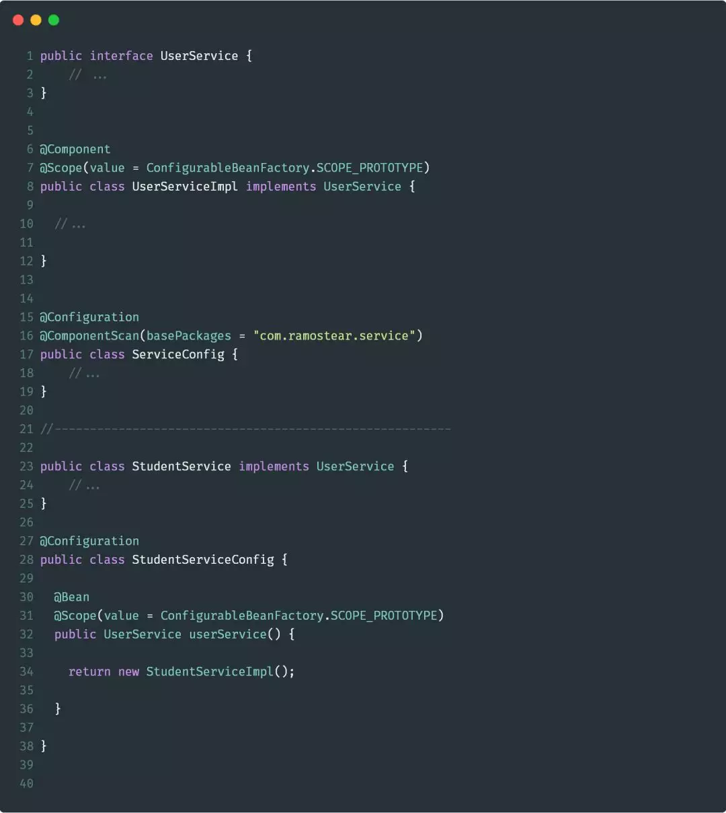

### 4.2 @Scope 单例模式

当@Scope的作用范围设置成Singleton时，被此注解所标注的类只会被Spring IoC容器初始化一次。在默认情况下，Spring IoC容器所初始化的类实例都为singleton。同样的原理，此情形也有两种配置方式，示例代码如下：

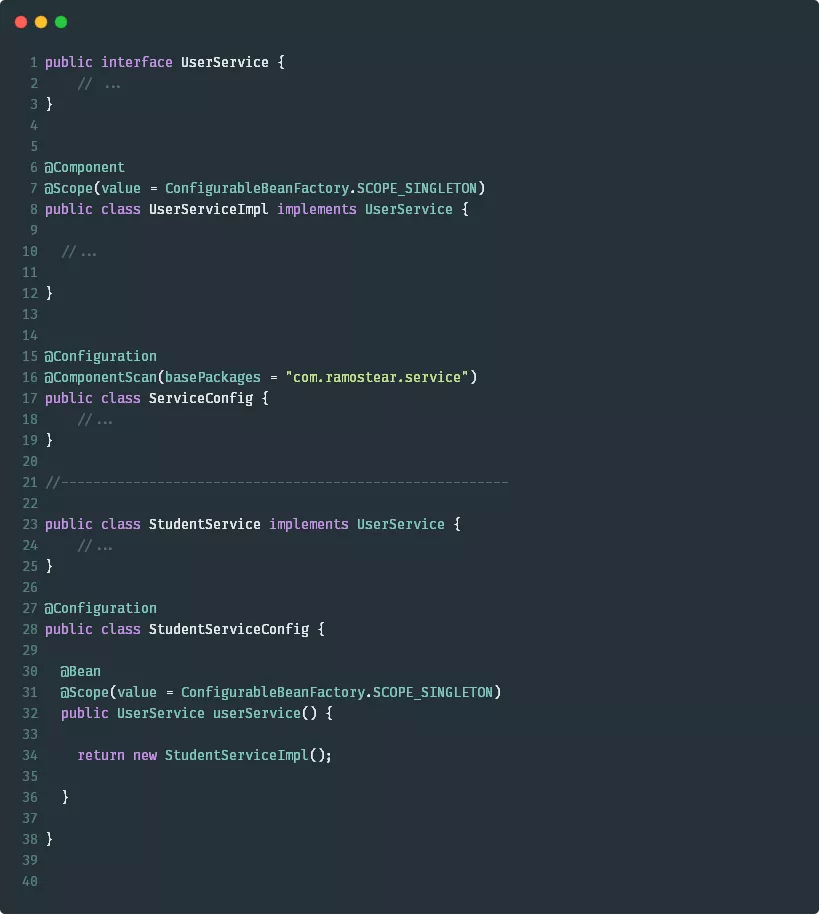

## 5 容器配置注解

### 5.1 @Autowired

@Autowired注解用于标记Spring将要解析和注入的依赖项。此注解可以作用在构造函数、字段和setter方法上。

#### 5.1.1 作用于构造函数

下面是@Autowired注解标注构造函数的使用示例：

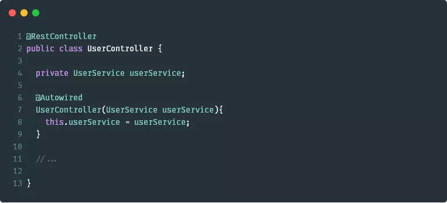

#### 5.1.2 作用于setter方法

下面是@Autowired注解标注setter方法的示例代码：

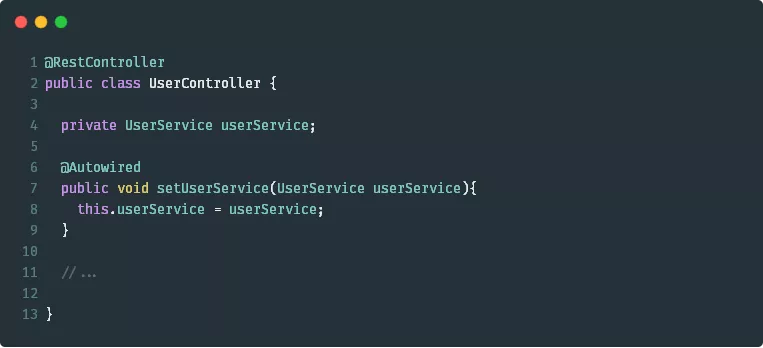

#### 5.1.3 作用于字段

@Autowired注解标注字段是最简单的，只需要在对应的字段上加入此注解即可，示例代码如下：

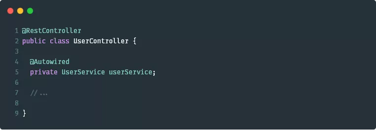

### 5.2 @Primary

当系统中需要配置多个具有相同类型的bean时，@Primary可以定义这些Bean的优先级。下面将给出一个实例代码来说明这一特性：

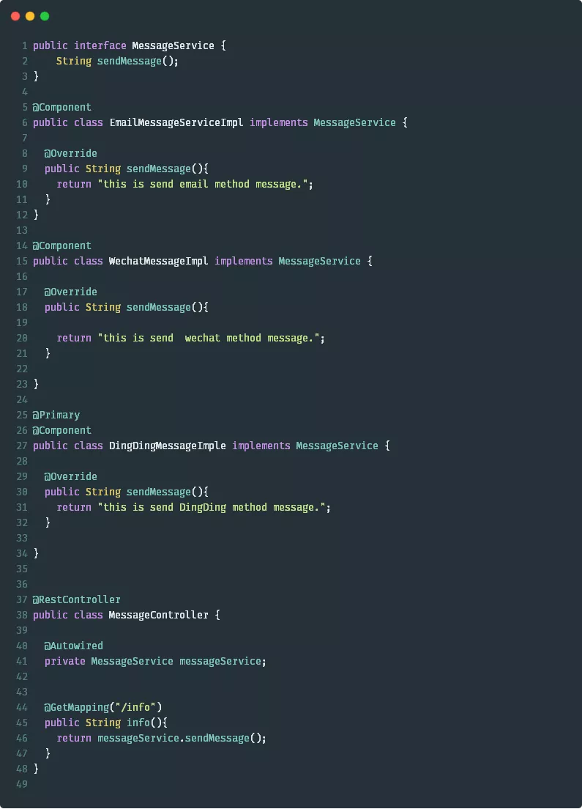

输出结果：

>this is send DingDing method message.

### 5.3 @PostConstruct与@PreDestroy

值得注意的是，这两个注解不属于Spring,它们是源于JSR-250中的两个注解，位于common-annotations.jar中。@PostConstruct注解用于标注在Bean被Spring初始化之前需要执行的方法。@PreDestroy注解用于标注Bean被销毁前需要执行的方法。下面是具体的示例代码：

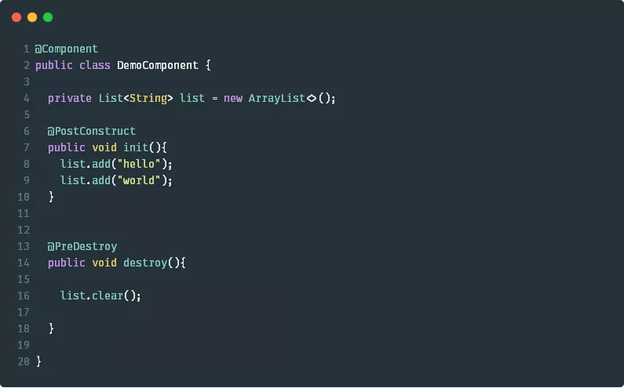

### 5.4 @Qualifier

当系统中存在同一类型的多个Bean时，@Autowired在进行依赖注入的时候就不知道该选择哪一个实现类进行注入。此时，我们可以使用@Qualifier注解来微调，帮助@Autowired选择正确的依赖项。下面是一个关于此注解的代码示例：

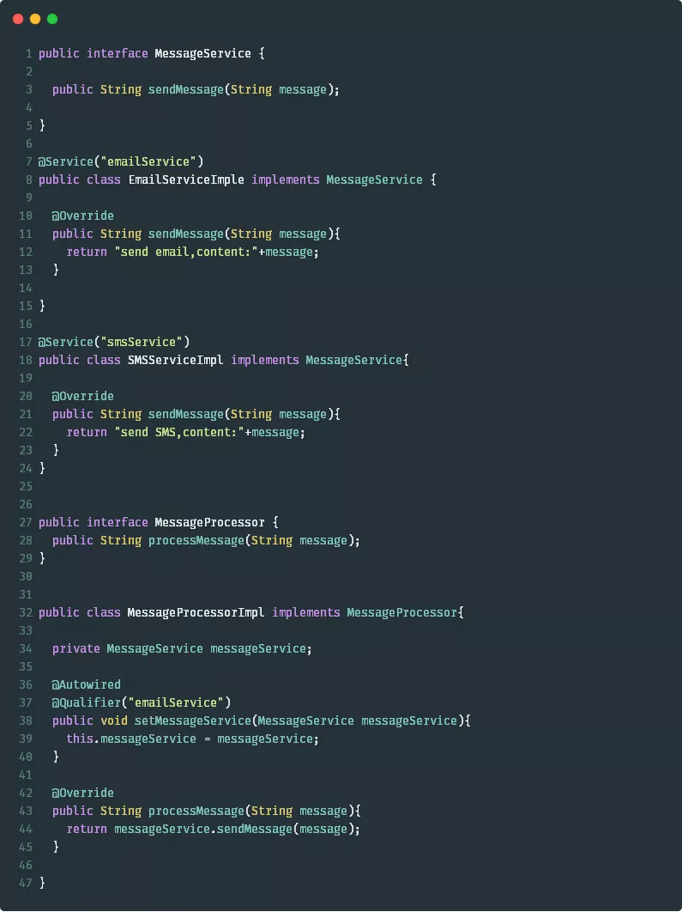

## 6 Spring Boot注解

### 6.1 @SpringBootApplication

@SpringBootApplication注解是一个快捷的配置注解，在被它标注的类中，可以定义一个或多个Bean，并自动触发自动配置Bean和自动扫描组件。此注解相当于@Configuration、@EnableAutoConfiguration和@ComponentScan的组合。在Spring Boot应用程序的主类中，就使用了此注解。示例代码如下：

```java
@SpringBootApplication
public class Application{
    public static void main(String [] args){
        SpringApplication.run(Application.class,args);
    }
}
```

### 6.2 @EnableAutoConfiguration

@EnableAutoConfiguration注解用于通知Spring，根据当前类路径下引入的依赖包，自动配置与这些依赖包相关的配置项。

### 6.3 @ConditionalOnClass与@ConditionalOnMissingClass

这两个注解属于类条件注解，它们根据是否存在某个类作为判断依据来决定是否要执行某些配置。下面是一个简单的示例代码：

```java
@Configuration
@ConditionalOnClass(DataSource.class)
class MySQLAutoConfiguration {
    //...
}
```

### 6.4 @ConditionalOnBean与@ConditionalOnMissingBean

这两个注解属于对象条件注解，根据是否存在某个对象作为依据来决定是否要执行某些配置方法。示例代码如下：

```java
@Bean
@ConditionalOnBean(name="dataSource")
LocalContainerEntityManagerFactoryBean entityManagerFactory(){
    //...
}
@Bean
@ConditionalOnMissingBean
public MyBean myBean(){
    //...
}
```

### 6.5 @ConditionalOnProperty

@ConditionalOnProperty注解会根据Spring配置文件中的配置项是否满足配置要求，从而决定是否要执行被其标注的方法。示例代码如下：

```java
@Bean
@ConditionalOnProperty(name="alipay",havingValue="on")
Alipay alipay(){
    return new Alipay();
}
```

### 6.6 @ConditionalOnResource

此注解用于检测当某个配置文件存在使，则触发被其标注的方法，下面是使用此注解的代码示例：

```java
@ConditionalOnResource(resources = "classpath:website.properties")
Properties addWebsiteProperties(){
    //...
}
```

### 6.7 @ConditionalOnWebApplication与@ConditionalOnNotWebApplication

这两个注解用于判断当前的应用程序是否是Web应用程序。如果当前应用是Web应用程序，则使用Spring WebApplicationContext,并定义其会话的生命周期。下面是一个简单的示例：

```java
@ConditionalOnWebApplication
HealthCheckController healthCheckController(){
    //...
}
```

### 6.8 @ConditionalExpression

此注解可以让我们控制更细粒度的基于表达式的配置条件限制。当表达式满足某个条件或者表达式为真的时候，将会执行被此注解标注的方法。

```java
@Bean
@ConditionalException("${localstore} && ${local == 'true'}")
LocalFileStore store(){
    //...
}
```

### 6.9 @Conditional

@Conditional注解可以控制更为复杂的配置条件。在Spring内置的条件控制注解不满足应用需求的时候，可以使用此注解定义自定义的控制条件，以达到自定义的要求。下面是使用该注解的简单示例：

```java
@Conditioanl(CustomConditioanl.class)
CustomProperties addCustomProperties(){
    //...
}
```
