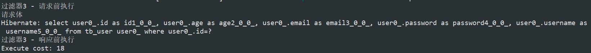

# Spring Boot 整合过滤器

## 1 方式一

## 1.1 单个过滤器

请求接口

```java
@RestController
@RequestMapping("/user")
public class UserController {
    @Autowired
    private UserServiceImpl userService;

    @GetMapping
    public User findById(@RequestParam Long id) {
        System.out.println("请求体"); //断点3
        User user = userService.findById(id);
        return user;
    }
}
```

过滤器

```java
public class LogCostFilter implements Filter {
    @Override
    public void doFilter(ServletRequest servletRequest, ServletResponse servletResponse, FilterChain filterChain) throws IOException, ServletException {
        long start = System.currentTimeMillis();
        System.out.println("过滤器1 - 请求前执行"); //断点1
        filterChain.doFilter(servletRequest, servletResponse); //断点2
        System.out.println("过滤器1 - 响应前执行"); //断点4
        System.out.println("Execute cost: " + (System.currentTimeMillis() - start));
    }
}
```

过滤器类要实现Filter接口，必须得重写doFilter方法。

- 写在`filterChain.doFilter(servletRequest, servletResponse);`之前的代码，在客户端的请求访问后端资源之前执行。
- 写在`filterChain.doFilter(servletRequest, servletResponse);`之后的代码，在服务器的响应发送回客户端之前执行。

有了过滤器类以后，以前的web项目可以在web.xml中进行配置，但是spring boot项目并没有web.xml这个文件，那怎么配置？在Spring boot中，我们需要FilterRegistrationBean来完成配置。

```java
@SpringBootApplication
public class SpringDataJpaApplication {

    public static void main(String[] args) {
        SpringApplication.run(SpringDataJpaApplication.class, args);
    }

    @Bean
    public FilterRegistrationBean registration() {
        FilterRegistrationBean registration = new FilterRegistrationBean();
        registration.setFilter(new LogCostFilter()); //实例化Filter类
        registration.addUrlPatterns("/*"); //指定url的匹配模式
        registration.setName("LogCostFilter"); //设置过滤器名称
        //registration.addInitParameter("paramName", "paramValue"); //指定初始化参数
        registration.setOrder(1); //设置执行顺序
        return registration;
    }
}
```

调用接口`localhost:8080/user?id=3`，打印内容：


在debug模式下，通过断点可以发现：

触发请求 -> 断点1 -> 断点2 -> 断点3 -> 断点4 -> 客户端收到返回结果

- 即请求在进入控制器controller之前，首先进入过滤器，被过滤器拦截。
- 在执行`filterChain.doFilter(servletRequest, servletResponse);`后，请求进入控制器被处理。
- 控制器处理完后，响应又进入过滤器，被`doFilter`后面得代码执行。


## 1.2 多个过滤器

```java
@RestController
@RequestMapping("/user")
public class UserController {
    @Autowired
    private UserServiceImpl userService;

    @GetMapping
    public User findById(@RequestParam Long id) {
        System.out.println("请求体"); //断点7
        User user = userService.findById(id);
        return user;
    }
}
```

```java
public class OtherFilter implements Filter {
    @Override
    public void doFilter(ServletRequest servletRequest, ServletResponse servletResponse, FilterChain filterChain) throws IOException, ServletException {
        long start = System.currentTimeMillis();
        System.out.println("过滤器2 - 请求前执行"); //断点1
        filterChain.doFilter(servletRequest, servletResponse); //断点2
        System.out.println("过滤器2 - 响应前执行"); //断点3
        System.out.println("Execute cost: " + (System.currentTimeMillis() - start));
    }
}
```

```java
public class OtherFilter implements Filter {
    @Override
    public void doFilter(ServletRequest servletRequest, ServletResponse servletResponse, FilterChain filterChain) throws IOException, ServletException {
        long start = System.currentTimeMillis();
        System.out.println("过滤器2 - 请求前执行"); //断点4
        filterChain.doFilter(servletRequest, servletResponse); //断点5
        System.out.println("过滤器2 - 响应前执行"); //断点6
        System.out.println("Execute cost: " + (System.currentTimeMillis() - start));
    }
}
```

```java
@SpringBootApplication
public class SpringDataJpaApplication {

    public static void main(String[] args) {
        SpringApplication.run(SpringDataJpaApplication.class, args);
    }

    @Bean
    public FilterRegistrationBean registration() {
        FilterRegistrationBean registration = new FilterRegistrationBean();
        registration.setFilter(new LogCostFilter());
        registration.addUrlPatterns("/*");
        registration.setName("LogCostFilter");
        registration.setOrder(1);
        return registration;
    }

    @Bean
    public FilterRegistrationBean otherRegistration() {
        FilterRegistrationBean registration = new FilterRegistrationBean();
        registration.setFilter(new OtherFilter());
        registration.addUrlPatterns("/*");
        registration.setName("otherFilter");
        registration.setOrder(2);
        return registration;
    }
}
```

调用接口`localhost:8080/user?id=3`，打印内容：


触发请求 -> 断点1 -> 断点2 -> 断点4 -> 断点5 -> 断点7 -> 断点6 -> 断点3 -> 客户端收到返回结果 


## 2 方式二

除了通过 FilterRegistrationBean 来配置以外，还有一种更直接的办法，直接通过注解就可以完成。

```java
@RestController
@RequestMapping("/user")
public class UserController {
    @Autowired
    private UserServiceImpl userService;

    @GetMapping
    public User findById(@RequestParam Long id) {
        System.out.println("请求体");
        User user = userService.findById(id);
        return user;
    }
}
```

```java
@WebFilter(urlPatterns = "/*", filterName = "annotationFilter")
public class annotationFilter implements Filter {
    @Override
    public void doFilter(ServletRequest servletRequest, ServletResponse servletResponse, FilterChain filterChain) throws IOException, ServletException {
        long start = System.currentTimeMillis();
        System.out.println("过滤器3 - 请求前执行");
        filterChain.doFilter(servletRequest, servletResponse);
        System.out.println("过滤器3 - 响应前执行");
        System.out.println("Execute cost: " + (System.currentTimeMillis() - start));
    }
}
```

```java
@SpringBootApplication
@ServletComponentScan("com.company.springdatajpa.filter")
public class SpringDataJpaApplication {

    public static void main(String[] args) {
        SpringApplication.run(SpringDataJpaApplication.class, args);
    }
}
```



@WebFilter这个注解并没有指定执行顺序的属性，其执行顺序依赖于Filter的名称，是根据Filter类名（注意不是配置的filter的名字）的字母顺序倒序排列，并且@WebFilter指定的过滤器优先级都高于FilterRegistrationBean配置的过滤器。