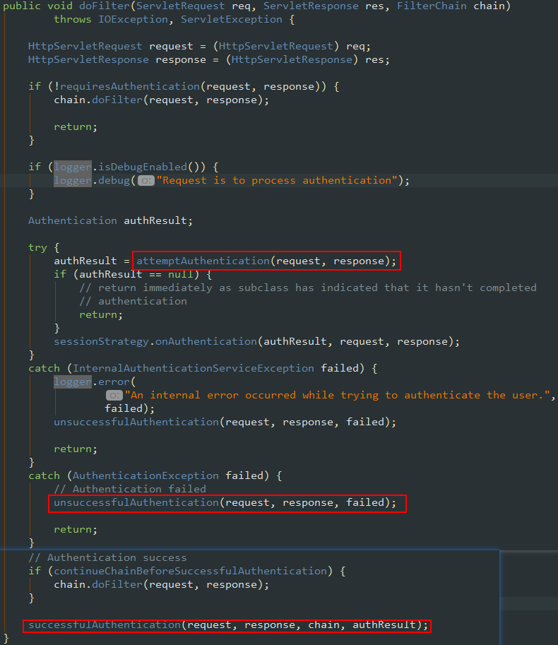
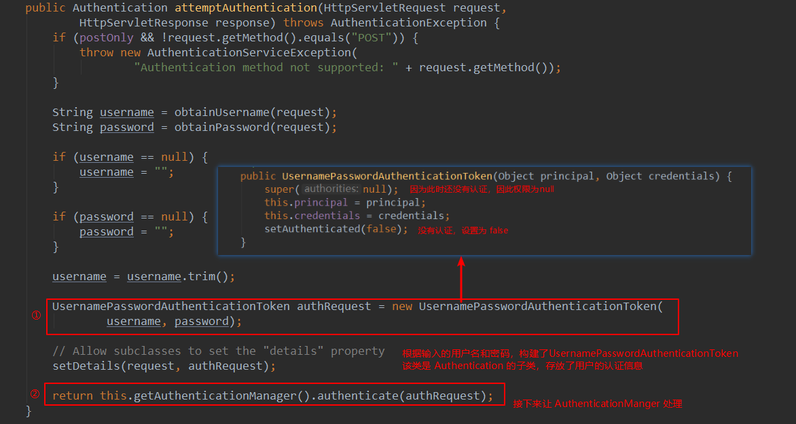
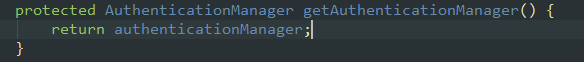
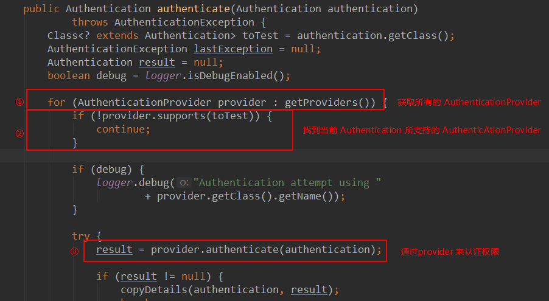
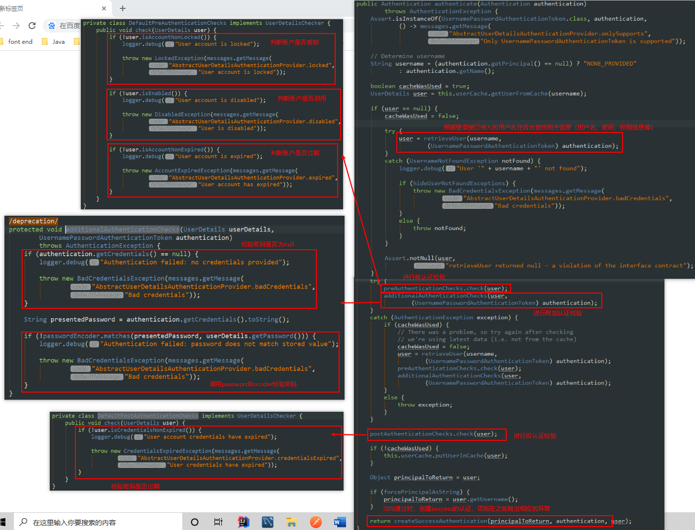
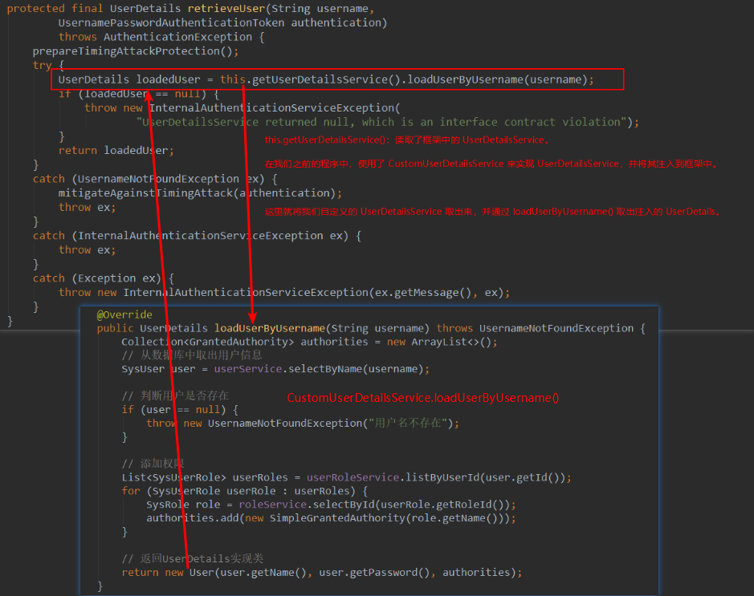
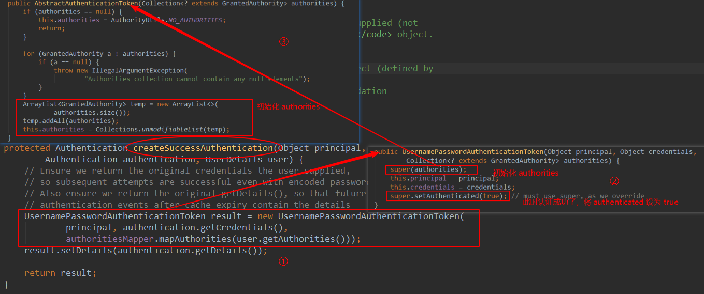
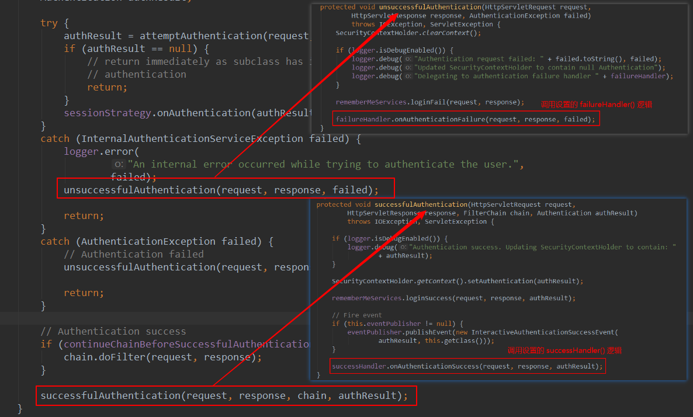

# 认证流程

## 1 UsernamePasswordAuthenticationFilter

继承自`AbstractAuthenticationProcessingFilter`

用户发起登录请求后，会经过`UsernamePasswordAuthenticationFilter`过滤器，其doFilter方法继承自父类`AbstractAuthenticationProcessingFilter`

方法`getAuthenticationManager` 定义再`UsernamePasswordAuthenticationFilter`中，

## 2 ProviderManager

实现了`AuthenticationManager`接口

我们知道不同的登录逻辑它的认证方式是不一样的，比如我们表单登录需要认证用户名和密码，但是当我们使用三方登录时就不需要验证密码。

Spring Security 支持多种认证逻辑，每一种认证逻辑的认证方式其实就是一种 AuthenticationProvider。通过 getProviders() 方法就能获取所有的 AuthenticationProvider，通过 provider.supports() 来判断 provider 是否支持当前的认证逻辑。

当选择好一个合适的 AuthenticationProvider 后，通过 provider.authenticate(authentication) 来让 AuthenticationProvider 进行认证。

## 3 AbstractUserDetailsAuthenticationProvider

实现了`AuthenticationProvider`接口

传统表单登录的 AuthenticationProvider 主要是由 AbstractUserDetailsAuthenticationProvider 来进行处理的，我们来看下它的 authenticate()方法。

通过 `retrieveUser()` 方法读取到数据库中的用户信息，当我们成功的读取 `UserDetails` 后，下面开始对其进行认证

`retrieveUser()` 的具体实现在 `DaoAuthenticationProvider` 中，代码如下：

我们可以看到认证校验分为 前校验、附加校验和后校验，如果任何一个校验出错，就会抛出相应的异常。所有校验都通过后，调用 `createSuccessAuthentication()` 返回认证信息。

在 createSuccessAuthentication 方法中，我们发现它重新 new 了一个 UsernamePasswordAuthenticationToken （包含正确的额用户名、密码、权限信息等），因为到这里认证已经通过了，所以将 authorities 注入进去，并设置 authenticated 为 true。

注意流程1中使用登录接口传入的用户名、密码也new 了一个 UsernamePasswordAuthenticationToken，但这里的用户名和密码可能是错误的。

UsernamePasswordAuthenticationToken用于封装用户名、密码、权限等信息，在认证之前，封装的信息可能不正确，当认证成功后，里面封装的就是正确的信息。

## 4 回到UsernamePasswordAuthenticationFilter

至此流程1中的`authResult = attemptAuthentication(request, response);`处理完毕。继续在doFilter中往下走，根据认证的成功或者失败调用相应的 handler：

这里调用的handler实际就是Security配置文件中的`successHandler()` 和 `failureHandler()`。
