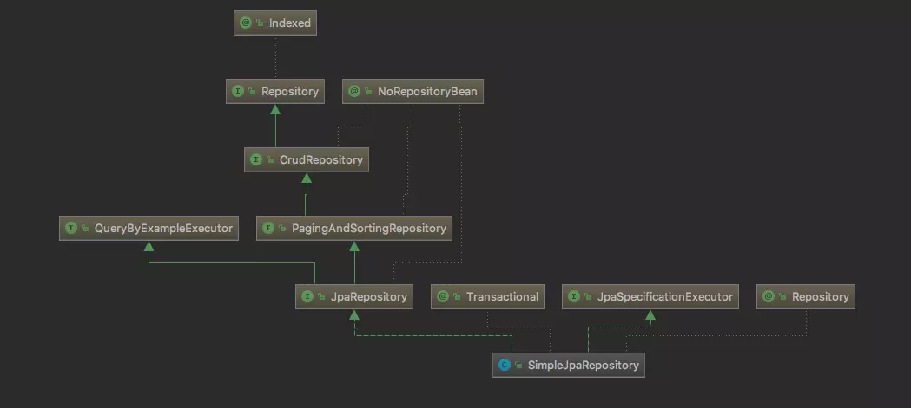
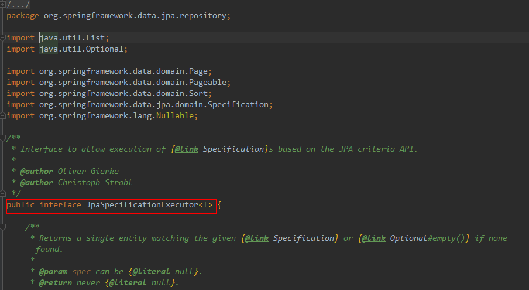

# Spring data jpa

简化对数据库的操作

## 1 整合Spring Data JPA

添加对应jar包，pom.xml

```xml
<!--spring data jpa 启动器-->
<dependency>
    <groupId>org.springframework.boot</groupId>
    <artifactId>spring-boot-starter-data-jpa</artifactId>
</dependency>

<!--MySQL驱动-->
<dependency>
    <groupId>mysql</groupId>
    <artifactId>mysql-connector-java</artifactId>
    <scope>8.0.18</scope>
</dependency>

<!--数据库连接池druid-->
<dependency>
    <groupId>com.alibaba</groupId>
    <artifactId>druid</artifactId>
    <version>1.1.10</version>
</dependency>
```

修改配置，application.properties
```properties
#数据库的基本信息
spring.datasource.driverClassName=com.mysql.cj.jdbc.Driver
spring.datasource.url=jdbc:mysql://localhost:3306/test?useSSL=false&serverTimezone=UTC
spring.datasource.username=root
spring.datasource.password=123456

#连接池信息
spring.datasource.type=com.alibaba.druid.pool.DruidDataSource

#spring boot jpa信息
spring.jpa.hibernate.ddl-auto=update
spring.jpa.show-sql=true
```

## 2 Spring Data JPA 提供的核心接口




接口|作用
:--|:--
1 Repository|提供了方法名称命名查询方式；提供了基于@Query注解查询与更新
2 CrudRepository|主要是完成一些增删改查的操作
3 PagingAndSortingRepository|提供分页和排序
4 JpaRepository|对继承的父接口中的方法的返回值进行适配
5 JpaSpecificationExectuor|该接口主要是提供了多条件查询的支持，并且可以在查询中添加分页与排序

- 通过命名也可以看出接口2、3、4继承了接口1，接口5相对独立单一
- 1、2、3在同一包spring-data-commons下
- 4、5在同一包spring-data-jpa下，偏应用些，在实际工作中用的多些

### 2.1 Repository

### 2.2 CrudRepository


### 2.3 PagingAndSortingRepository


finAll(Sort)只能排序，findAll(Pageable)既可以分页也可以排序，这两个方法查出的是表中所有数据，无法通过条件查询。

下面是包含查询条件的分页和排序

```java
// 方法必须先在继承JpaRepository的接口中自定义了，才能使用
// 基于@Query方式
@Query("select u from User u where u.username like %?1%")
Page<User> findByUsernameLike(String username, Pageable pageable);

@Query("select u from User u where u.username like %?1%")
List<User> findByUsernameAndSort(String username, Sort sort);

// 方法必须先在继承JpaRepository的接口中自定义了，才能使用
// 基于方法名称命名查询方式
Page<User> findByUsernameLike(String username, Pageable pageable);

List<User> findByUsernameAndSort(String username, Sort sort);
```
**即上述方法必须先在继承JpaRepository的接口中自定义了，才能使用**

```java
package com.company.dao;

import com.company.pojo.Users;
import org.springframework.data.jpa.repository.JpaRepository;

public interface UsersRepository extends JpaRepository<Users, Integer> {
    // 位置1
}
```

```java
@RunWith(SpringJUnit4ClassRunner.class)
@SpringBootTest
public class UsersRepositoryTest {

    @Autowired
    private UsersRepository usersRepository;

    @Test
    public void testQuery() {
        // 这里可以使用findById，但是不能使用findByNane，如果想使用findByNane，则必须在接口UsersRepository位置1处定义该方法（只需定义即可，实现就交给Spring Date Jpa）
        UsersRepository.findById(2);
    }
```

### 2.4 JpaSpecificationExectuor

该接口一般和JpaRepository接口搭配使用，即一个接口同时继承这两个接口


Specification用于封装查询条件


