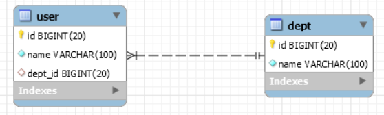

# 一对多

使用用户跟部门的关系来讲解一对多关系，一个部门下有很多个用户，一个用于只属于一个部门。部门是一方，用户是多方。

- 多方 维护关系维护，实体User的dept属性上使用@ManyToOne、@JoinColumn。
- 一方 如果是双向，实体Dept的userList属性上使用@OneToMany，如果是单向，多方可以不加userList属性（也就不需要使用@OneToMany）。

注解@ManyToOne、@JoinColumn成对出现，用在many方，即多方。会在对应的表中生成外键。修饰的属性的类型一般是多方实体，如Dept

注解@OneToMany单独出现，用在one方，即一方。在数据库中不会生成实际字段。修饰的属性的类型一般为`List<一方实体>`，`List<User>`

## 1 双向一对多

在User实体中有Dept类型字段，在Dept实体中有`List<User>`类型字段

```java
@Entity
@Getter
@Setter
public class User {
    @Id
    @GeneratedValue(strategy = GenerationType.IDENTITY)
    private Long id;

    @Column(length = 100, nullable = false)
    private String name;

    @ManyToOne //多对一，表示多个用户对应一个部门
    @JoinColumn //会在user表下创建一个外键，因为属性dept的类型是Dept，所以外键参考的表是dept，参考的列是表dept的主键，即id列，外键名称默认参考的表名_参考的列名，即dept_id
    private Dept dept;
}
```

上面也可以通过`@JoinColumn(name = "dept_id", referencedColumnName = "id")`显式的设置外键名、外键参考列

```java
@Entity
@Getter
@Setter
public class Dept {
    @Id
    @GeneratedValue(strategy = GenerationType.IDENTITY)
    private Long id;

    @Column(length = 100, nullable = false)
    private String name;

    @OneToMany(mappedBy = "dept") // 一对多，表示一个部门下有多个用户，注解属性mappedBy的值为User中的dept属性名称
    private List<User> userList;
}
```

`mappedBy = "dept"`的作用

- 表示Dept是关系被维护方（也就是一方），关系可以从User实体（因为属性userList的泛型是User）的dept属性上获取。
- 若不加`mappedBy = "dept"`会额外创建一个中间表dept_user_list，列有dept_id、user_list_id（最好还是加上`mappedBy = "dept"`，没必要生成中间表）。

生成的表如下：



## 2 单向一对多

在User实体中有Dept类型字段，在Dept实体中没有`List<User>`类型字段

```java
@Entity
@Getter
@Setter
public class User {
    @Id
    @GeneratedValue(strategy = GenerationType.IDENTITY)
    private Long id;

    @Column(length = 100, nullable = false)
    private String name;

    @ManyToOne //多对一，表示多个用户对应一个部门
    @JoinColumn //会在user表下创建一个外键，因为属性dept的类型是Dept，所以外键参考的表是dept，参考的列是表dept的主键，即id列，外键名称默认参考的表名_参考的列名，即dept_id
    private Dept dept;
}
```

```java
@Entity
@Getter
@Setter
public class Dept {
    @Id
    @GeneratedValue(strategy = GenerationType.IDENTITY)
    private Long id;

    @Column(length = 100, nullable = false)
    private String name;
}
```

## 3 测试

```java
Dept dept = new Dept();
dept.setName("developer");

User user = new User();
user.setName("Jack");
user.setDept(dept);

userRepository.save(user);
```

执行上面会报org.springframework.dao.InvalidDataAccessApiUsageException异常

应该改为

```java
Dept dept = new Dept();
dept.setName("developer");
deptRepository.save(dept);

User user = new User();
user.setName("Jack");
user.setDept(deptRepository.findByName("developer"));

userRepository.save(user);
```

总共执行了3条sql语句，如下


注意，如果部门表是空的，先向部门表插入一条记录，再向部门表查询一条数据，再向用户表插入一条记录。即先插入部门，再插入用户。

## 4 @manyToOne(opntional = true)

optional属性是定义该关联类是否必须存在，值为false 时，关联类双方都必须存在，如果关系被维护端不存在，查询的结果为null。值为true 时, 关系被维护端可以不存在，查询的结果仍然会返回关系维护端，在关系维护端中指向关系被维护端的属性为null。optional属性的默认值是true。

例子

```java
@Entity
@Getter
@Setter
public class User {
    @Id
    @GeneratedValue(strategy = GenerationType.IDENTITY)
    private Long id;

    @Column(length = 100, nullable = false)
    private String name;

    @ManyToOne(optional = false)
    @JoinColumn
    private Dept dept;
}
```


```java
User user = userRepository.findById(3L).get(); //执行该语句会报java.util.NoSuchElementException异常
```


