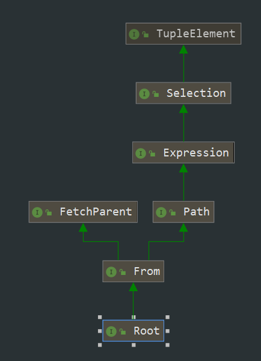

# 动态、多条件查询1

SQL WHERE子句中的运算符

| 运算符  | 描述                                | CriteriBuilder相应的方法    |
| :------ | :---------------------------------- | :-------------------------- |
| =       | 等于                                | equal                       |
| <>      | 不等于                              | notEqual                    |
| >       | 大于                                | gt                          |
| > >=    | 大于等于                            | ge                          |
| <       | 小于                                | lt                          |
| <=      | 小于等于                            | le                          |
| BETWEEN | 再某个范围内（包含首尾）            | between                     |
| LIKE    | 搜索某种模式                        | like                        |
| IN      | 与 = 类似，规定某个字段多个可能的值 | CriteriaBuilder#in、Path#in |

先写个架子，如下

```java
Specification<User> specification = ((root, query, cb) -> {
    List<Predicate> predicateList = new ArrayList<>();

    //查询条件...

    return cb.and(predicateList.toArray(new Predicate[predicateList.size()]));
});

List<User> userList = userRepository.findAll(specification);

```
下面把多种查询条件写在一起，只是为了节省代码编写，测试时，只保留需要测试的条件，其余条件注释掉。

```java
import javax.persistence.criteria.Predicate;
import java.sql.Date;

//...

@Test
public void criteria() throws ParseException {
    //模拟查询参数（实际web项目中从请求参数中获得）
    String name = "Jack";
    Date birthday = new Date(new SimpleDateFormat("yyyy-MM-dd").parse("1992-05-20").getTime());
    Date startDate = new Date(new SimpleDateFormat("yyyy-MM-dd").parse("1991-01-01").getTime());
    Date endDate = new Date(new SimpleDateFormat("yyyy-MM-dd").parse("1991-12-30").getTime());
    Integer salary = 2000;
    
    Long[] deptIds = {1L, 2L};
    List<Long> deptIdList = new ArrayList<>(Arrays.asList(deptIds));

    String[] names = {"Jack", "Tom"};
    List<String> nameList = new ArrayList<>(Arrays.asList(names));

    Specification<User> specification = ((root, query, cb) -> {
        List<Predicate> predicateList = new ArrayList<>();

        //1 equal、notEqual
        if (null != name) {
            //predicateList.add(cb.equal(root.get("name"), name));
            predicateList.add(cb.notEqual(root.get("name"), name));
        }

        //2 like
        if (null != name) {
            //predicateList.add(cb.like(root.get("name"), "%" + name));
            //predicateList.add(cb.like(root.get("name"), name + "%"));
            predicateList.add(cb.like(root.get("name"), "%" + name + "%"));
        }

        //3 gt、ge、lt、le
        if (null != salary) {
            //predicateList.add(cb.gt(root.get("salary"), salary));
            //predicateList.add(cb.ge(root.get("salary"), salary));
            //predicateList.add(cb.lt(root.get("salary"), salary));
            predicateList.add(cb.le(root.get("salary"), salary));
        }

        //4 equal
        if (null != birthday) {
            //predicateList.add(cb.equal(root.get("birthday").as(String.class), "1992-05-20"));
            predicateList.add(cb.equal(root.get("birthday"), birthday));
        }

        //5 between
        if (null != startDate && null != endDate) {
            predicateList.add(cb.between(root.get("birthday"), startDate, endDate));
        }

        //6 CriteriaBuilder#in、Path#in
        if (null != nameList) {
            //方式一
            //CriteriaBuilder.In in = cb.in(root.get("name"));
            //for (String s : nameList) {
            //    in.value(s);
            //}
            //predicateList.add(in);

            //方式二
            predicateList.add(root.get("name").in(nameList));
        }

        //7 Path#in
        if (null != deptIdList) {
            predicateList.add(root.get("dept").get("id").in(deptIdList));
        }

        return cb.and(predicateList.toArray(new Predicate[predicateList.size()]));
    });

    List<User> userList = userRepository.findAll(specification);
    System.out.println(userList);
}
```

## 1 equal、notEqual

```java
if (null != name) {
    //查询用户名为Jack的用户
    //predicateList.add(cb.equal(root.get("name"), name));

    //查询用户名不为Jack的用户
    predicateList.add(cb.notEqual(root.get("name"), name));
}
```

## 2 like

```java
if (null != name) {
    //查询用户名以Jack结尾的用户
    //predicateList.add(cb.like(root.get("name"), "%" + name));

    //查询用户名以Jack开头的用户
    //predicateList.add(cb.like(root.get("name"), name + "%"));

    //查询用户名中包含Jack的用户
    predicateList.add(cb.like(root.get("name"), "%" + name + "%"));
}
```
还有-

## 3 gt、ge、lt、le

```java
if (null != salary) {
    //查询薪资大于2000的用户
    //predicateList.add(cb.gt(root.get("salary"), salary));

    //查询薪资大于等于2000的用户
    //predicateList.add(cb.ge(root.get("salary"), salary));

    //查询薪资小于2000的用户
    //predicateList.add(cb.lt(root.get("salary"), salary));

    //查询薪资小于等于2000的用户
    predicateList.add(cb.le(root.get("salary"), salary));
}
```

还有GreaterThan、、、

## 4 equal

```java
if (null != birthday) {
    //查询生日为1992-05-20的用户
    //predicateList.add(cb.equal(root.get("birthday").as(String.class), "1992-05-20"));
    predicateList.add(cb.equal(root.get("birthday"), birthday)); 
}
```

一定要准确设置时区，否则会出现问题

## 5 between

```java
if (null != startDate && null != endDate) {
    //查询生日在1991-01-01和1991-12-30之间的用户
    predicateList.add(cb.between(root.get("birthday"), startDate, endDate));
}
```

## 6 CriteriaBuilder#in、Path#in

```java
if (null != nameList) {
    //查询用户名是Jack、Tom中一种的用户
    //方式一
    //CriteriaBuilder.In in = cb.in(root.get("name"));
    //for (String s : nameList) {
    //    in.value(s);
    //}
    //predicateList.add(in);

    //方式二
    predicateList.add(root.get("name").in(nameList));
}
```

两种方式作用一样，方式二简洁点

## 7 Path#in

```java
if (null != deptIdList) {
    //查询部门ID是1L、2L中一种的用户
    predicateList.add(root.get("dept").get("id").in(deptIdList));
}
```
Path接口用于定位（寻找）实体的属性，其get方法，作用相当于JPQL中的点（.）连接符


