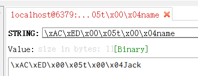
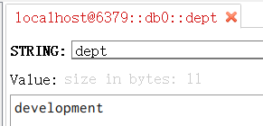

# Spring Data Redis

## 1 基本使用

```xml
<dependency>
    <groupId>org.springframework.boot</groupId>
    <artifactId>spring-boot-starter-data-redis</artifactId>
</dependency>
```

Redis数据库如果设置了密码，需要在application.properties添加如下内容

```xml
spring.redis.password=xxx
```

通过以上步骤：导入依赖包、设置必要配置，就可以通过在项目中自动注入RedisTemplate、StringRedisTemplate来进行Redis的相关操作。

## 2 自动配置相关类

### 2.1 RedisProperties

`org.springframework.boot.autoconfigure.data.redis.RedisProperties`

该类中定义了一些自定义配置相关的类，如database、host、port、password等。

### 2.2 RedisAutoConfiguration

`org.springframework.boot.autoconfigure.data.redis.RedisAutoConfiguration`

```java
@Configuration
@ConditionalOnClass(RedisOperations.class)
@EnableConfigurationProperties(RedisProperties.class)
@Import({ LettuceConnectionConfiguration.class, JedisConnectionConfiguration.class })
public class RedisAutoConfiguration {

	@Bean
	@ConditionalOnMissingBean(name = "redisTemplate")
	public RedisTemplate<Object, Object> redisTemplate(RedisConnectionFactory redisConnectionFactory)
			throws UnknownHostException {
		RedisTemplate<Object, Object> template = new RedisTemplate<>();
		template.setConnectionFactory(redisConnectionFactory);
		return template;
	}

	@Bean
	@ConditionalOnMissingBean
	public StringRedisTemplate stringRedisTemplate(RedisConnectionFactory redisConnectionFactory)
			throws UnknownHostException {
		StringRedisTemplate template = new StringRedisTemplate();
		template.setConnectionFactory(redisConnectionFactory);
		return template;
	}

}
```

默认向Spring 容器中注入RedisTemplate、StringRedisTemplate。

## 3 `RedisTemplate` 和 `StringRedisTemplate` 区别

`StringRedisTemplate` 类是 `RedisTemplate`类的子类。

两者之间的区别主要在于他们使用的序列化类：

- RedisTemplate使用的是JdkSerializationRedisSerializer，存入数据库会将数据先序列化成字节数组，然后再存入Redis数据库。
- StringRedisTemplate使用的是StringRedisSerializer

```java
@Test
public void testRedisTemplate() {
    ValueOperations ops = redisTemplate.opsForValue();
    ops.set("name", "Jack");
    String name = (String) ops.get("name");
    System.out.println(name); //Jack
}
```



```java
@Test
public void testStringRedisTemplate() {
    ValueOperations ops = stringRedisTemplate.opsForValue();
    ops.set("dept", "development");
    Object dept = ops.get("dept");
    System.out.println(dept);
}
```


