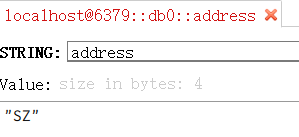

# 自定义序列器

默认情况下，RedisTemplate使用的是JdkSerializationRedisSerializer，StringRedisTemplate使用的是StringRedisSerializer。

自定义序列器需要实现 `RedisSerializer` 接口。

```java
ValueOperations ops = redisTemplate.opsForValue();
ops.set("address", "SZ");
String address = (String) ops.get("address");
System.out.println(address); //SZ
```



```java
@Configuration
public class RedisConfig {
    @Bean
    public RedisTemplate<Object, Object> redisTemplate(RedisConnectionFactory redisConnectionFactory) {
        RedisTemplate<Object, Object> template = new RedisTemplate<>();

        FastJsonRedisSerializer<Object> fastJsonRedisSerializer = new FastJsonRedisSerializer<>(Object.class);
        // 全局开启AutoType，这里方便开发，使用全局的方式
        ParserConfig.getGlobalInstance().setAutoTypeSupport(true);

        // value值的序列化采用fastJsonRedisSerializer
        template.setValueSerializer(fastJsonRedisSerializer);
        template.setHashValueSerializer(fastJsonRedisSerializer);

        // key的序列化采用StringRedisSerializer
        template.setKeySerializer(new StringRedisSerializer());
        template.setHashKeySerializer(new StringRedisSerializer());
        template.setConnectionFactory(redisConnectionFactory);

        return template;
    }

    /**
     * 自定义fastJson序列化器
     * @param <T>
     */
    class FastJsonRedisSerializer<T> implements RedisSerializer<T> {
        private Class<T> clazz;

        public FastJsonRedisSerializer(Class<T> clazz) {
            super();
            this.clazz = clazz;
        }

        @Override
        public byte[] serialize(T t) throws SerializationException {
            if (t == null) {
                return new byte[0];
            }
            return JSON.toJSONString(t, SerializerFeature.WriteClassName).getBytes(StandardCharsets.UTF_8);
        }

        @Override
        public T deserialize(byte[] bytes) throws SerializationException {
            if (bytes == null || bytes.length <= 0) {
                return null;
            }
            String str = new String(bytes, StandardCharsets.UTF_8);
            return JSON.parseObject(str, clazz);
        }
    }

}
```