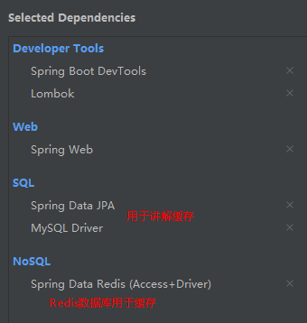

# Spring Cache + Redis

[史上最全的Spring Boot Cache使用与整合](https://blog.csdn.net/qq_32448349/article/details/101696892)



```xml
<dependency>
    <groupId>org.springframework.boot</groupId>
    <artifactId>spring-boot-starter-cache</artifactId>
</dependency>
```

## 注解

| 名称           | 解释                                                                                 |
| :------------- | :----------------------------------------------------------------------------------- |
| @EnableCaching | 开启基于注解的缓存                                                                   |
| @CacheConfig   | 统一配置本类的缓存注解的属性                                                         |
| @Cacheable     | 主要针对方法配置，能够根据方法的请求参数对其进行缓存                                 |
| @CachePut      | 保证方法被调用，又希望结果被缓存。与@Cacheable区别在于是否每次都调用方法，常用于更新 |
| @CacheEvict    | 清空缓存                                                                             |

@Cacheable/@CachePut/@CacheEvict 主要的参数

| 名称                              | 解释                                                                                                                                                                                                          |
| :-------------------------------- | :------------------------------------------------------------------------------------------------------------------------------------------------------------------------------------------------------------ |
| value                             | 缓存的名称，在 spring 配置文件中定义，必须指定至少一个<br>例如：<br>@Cacheable(value=”mycache”) 或者<br>@Cacheable(value={”cache1”,”cache2”}                                                                  |
| key                               | 缓存的 key，可以为空，如果指定要按照 SpEL 表达式编写，如果不指定，则缺省按照方法的所有参数进行组合<br>例如：<br>@Cacheable(value=”testcache”,key=”#id”)                                                       |
| condition                         | 缓存的条件，可以为空，使用 SpEL 编写，返回 true 或者 false，只有为 true 才进行缓存/清除缓存<br>例如：@Cacheable(value=”testcache”,condition=”#userName.length()>2”)                                           |
| unless                            | 否定缓存。当条件结果为TRUE时，就不会缓存。@Cacheable(value=”testcache”,unless=”#userName.length()>2”)                                                                                                         |
| allEntries<br>(@CacheEvict )      | 是否清空所有缓存内容，缺省为 false，如果指定为 true，则方法调用后将立即清空所有缓存<br>例如：<br>@CachEvict(value=”testcache”,allEntries=true)                                                                |
| beforeInvocation<br>(@CacheEvict) | 是否在方法执行前就清空，缺省为 false，如果指定为 true，则在方法还没有执行的时候就清空缓存，缺省情况下，如果方法执行抛出异常，则不会清空缓存<br>例如：<br>@CachEvict(value=”testcache”，beforeInvocation=true) |

## SpEL上下文数据

Spring Cache提供了一些供我们使用的SpEL上下文数据，下表直接摘自Spring官方文档：

| 名称          | 位置       | 描述                                                                                         | 示例                 |
| :------------ | :--------- | :------------------------------------------------------------------------------------------- | :------------------- |
| methodName    | root对象   | 当前被调用的方法名                                                                           | #root.methodname     |
| method        | root对象   | 当前被调用的方法                                                                             | #root.method.name    |
| target        | root对象   | 当前被调用的目标对象实例                                                                     | #root.target         |
| targetClass   | root对象   | 当前被调用的目标对象的类                                                                     | #root.targetClass    |
| args          | root对象   | 当前被调用的方法的参数列表                                                                   | #root.args[0]        |
| caches        | root对象   | 当前方法调用使用的缓存列表                                                                   | #root.caches[0].name |
| Argument Name | 执行上下文 | 当前被调用的方法的参数，如findArtisan(Artisan artisan),可以通过#artsian.id获得参数           | #artsian.id          |
| result        | 执行上下文 | 方法执行后的返回值（仅当方法执行后的判断有效，如 unless cacheEvict的beforeInvocation=false） | #result              |

注意：

1.当我们要使用root对象的属性作为key时我们也可以将“#root”省略，因为Spring默认使用的就是root对象的属性。 如

@Cacheable(key = "targetClass + methodName +#p0")

2.使用方法参数时我们可以直接使用“#参数名”或者“#p参数index”。 如：

@Cacheable(value="users", key="#id")

@Cacheable(value="users", key="#p0")

SpEL提供了多种运算符

| 类型       | 运算符                                         |
| :--------- | :--------------------------------------------- |
| 关系       | <，>，<=，>=，==，!=，lt，gt，le，ge，eq，ne   |
| 算术       | +，- ，* ，/，%，^                             |
| 逻辑       | &&，`||`，!，and，or，not，between，instanceof |
| 条件       | ?: (ternary)，?: (elvis)                       |
| 正则表达式 | matches                                        |
| 其他类型   | ?.，?[…]，![…]，^[…]，$[…]                     |