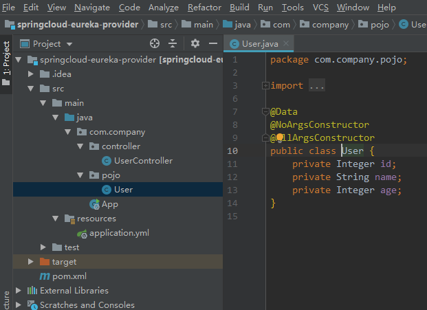
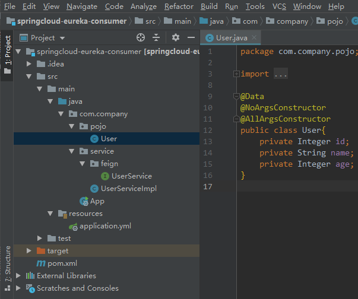

# Spring Cloud 客户端

不管是Spring Cloud服务端、客户端、还是后面会讲到的网关，都是一个个Spring Boot应用，或者说是一个个微服务。因此要提前了解Spring Cloud的功能特性。

客户端分为服务提供者和服务消费者，服务提供者和服务消费者是相对的概念，如果一个服务中的接口被其他服务调用，则该服务就是服务的提供者，如果这个服务使用了其他服务的接口，那么该服务也是服务的消费者。

Spring Cloud中一个微服务调用另一个微服务的方式有两种，一种是RestTemplate，一种是使用feign。不管是哪种方式本质是用代码的形式执行http请求，如同Httpclient技术，如同浏览器、postman中执行请求一样，明显的区别是浏览器、postman提供了可视化界面。

既然是http请求，就要知道主机（ip+端口、或者是域名）、接口路径、请求方式、参数等，

## 1 服务提供者

```xml
<dependencies>
    <!-- 省略了其他次要依赖 -->
    <!-- 服务消费者也是Spring Cloud客户端，所以要加这个依赖 -->
    <dependency>
        <groupId>org.springframework.cloud</groupId>
        <artifactId>spring-cloud-starter-netflix-eureka-client</artifactId>
    </dependency>
</dependencies>

<!-- dependencyManagement 写在dependencies下方-->
<dependencyManagement>
    <dependencies>
        <!-- <scope>import</scope>解决单继承问题，类似parent标签， -->
        <dependency>
            <groupId>org.springframework.cloud</groupId>
            <artifactId>spring-cloud-dependencies</artifactId>
            <version>Greenwich.RELEASE</version>
            <type>pom</type>
            <scope>import</scope>
        </dependency>
    </dependencies>
</dependencyManagement>
```



springcloud-eureka-provider服务提供了一个get请求方式、`/test/user`路径、无需参数的接口

```java
package com.company.controller;

import com.company.pojo.User;
import org.springframework.web.bind.annotation.RequestMapping;
import org.springframework.web.bind.annotation.RestController;

import java.util.ArrayList;
import java.util.List;

@RestController
@RequestMapping("/test")
public class UserController {
    @RequestMapping("/user")
    public List<User> getUsers(@RequestParam(value = "name") String name){
        List<User> list = new ArrayList<>();
        User user1 = new User(1, "张1", 21);
        User user2 = new User(2, "张2", 22);
        User user3 = new User(3, "张3", 23);
        list.add(user1);
        list.add(user2);
        list.add(user3);
        return list;
    }
}
```

```java
package com.company;

import org.springframework.boot.SpringApplication;
import org.springframework.boot.autoconfigure.SpringBootApplication;
import org.springframework.cloud.netflix.eureka.EnableEurekaClient;

@SpringBootApplication // 标识Spring Boot应用入口
@EnableEurekaClient // 标识Spring Cloud客户端
public class App {
    public static void main(String[] args) {
        SpringApplication.run(App.class, args);
    }
}
```

```yml
server:
  port: 8001

spring:
  application:
    name: springcloud-eureka-provider

eureka:
  client:
    service-url:
      defaultZone: http://localhost1:7001/eureka/,http://localhost2:7002/eureka/
```

## 2 服务消费者

```xml
<dependencies>
    <!-- 省略了其他次要依赖 -->
    <!-- 服务消费者也是Spring Cloud客户端，所以要加这个依赖 -->
    <dependency>
        <groupId>org.springframework.cloud</groupId>
        <artifactId>spring-cloud-starter-netflix-eureka-client</artifactId>
    </dependency>

    <!-- feign方式调用接口所需的依赖 -->
    <dependency>
        <groupId>org.springframework.cloud</groupId>
        <artifactId>spring-cloud-starter-openfeign</artifactId>
        <!-- 这里会自动引入版本，类似parent标签继承 -->
    </dependency>
</dependencies>

<!-- dependencyManagement 写在dependencies下方-->
<dependencyManagement>
    <dependencies>
        <!-- <scope>import</scope>解决单继承问题，类似parent标签， -->
        <dependency>
            <groupId>org.springframework.cloud</groupId>
            <artifactId>spring-cloud-dependencies</artifactId>
            <version>Greenwich.RELEASE</version>
            <type>pom</type>
            <scope>import</scope>
        </dependency>
    </dependencies>
</dependencyManagement>
```



```yml
server:
  port: 8002

spring:
  application:
    name: springcloud-eureka-consumer

eureka:
  client:
    service-url:
      defaultZone: http://localhost1:7001/eureka/,http://localhost2:7002/eureka/
```

1. 服务消费者的主启动类上需要加上`@EnableFeignClients`注解，需要注意的是，如果你定义的Feign接口不在主启动类包或其子包下（即不在@ComponentScan扫描范围内），则需添加basePackages属性去指明Feign接口的包位置，如`@EnableFeignClients(basePackages = "com.company.service.feign")`。这一点很重要，否则会报不能@Autowired UserService 的错

```java
package com.company;

import org.springframework.boot.SpringApplication;
import org.springframework.boot.autoconfigure.SpringBootApplication;
import org.springframework.cloud.client.discovery.EnableDiscoveryClient;
import org.springframework.cloud.netflix.eureka.EnableEurekaClient;
import org.springframework.cloud.openfeign.EnableFeignClients;

@SpringBootApplication // 标识Spring Boot应用入口
@EnableEurekaClient // 标识Spring Cloud客户端
@EnableFeignClients
public class App {
    public static void main(String[] args) {
        SpringApplication.run(App.class, args);
    }
}
```

2. 通过SPRINGCLOUD-EUREKA-PROVIDER在注册中心可以找到对应微服务，即确定了被调接口的（ip+端口、或者是域名）；
    通过UserService上方的`@RequestMapping`和getUser上方的`@RequestMapping`组合映射路径，即确定接口路径；
    `@RequestMapping`默认是get请求，即表示http请求方式为get;
    下面调用getUser方法时传了参数`张`，即相当于对http请求传了参数;

    UserService上可以加@RequestMapping注解，不用加@RestController注解

    getUser方法名、返回值 不需要与服务提供者中 getUsers的相同，但要求最终映射的接口路径要一样
```java
package com.company.service.feign;

import com.company.pojo.User;
import org.springframework.cloud.openfeign.FeignClient;
import org.springframework.web.bind.annotation.RequestMapping;

import java.util.List;

@FeignClient(name = "SPRINGCLOUD-EUREKA-PROVIDER") //远程服务名，即spring.application.name配置的名称
public interface UserService {
    @RequestMapping(value = "/test/user") // 请求路径要相同
    List<User> getUser(@RequestParam(value = "name") String name);
}
```


3. 服务消费者，就像调用本地方法一样去调用定义的feign接口就可以了
```java
package com.company.service;

import com.company.pojo.User;
import com.company.service.feign.UserService;
import org.springframework.beans.factory.annotation.Autowired;
import org.springframework.web.bind.annotation.RequestMapping;
import org.springframework.web.bind.annotation.RestController;

import java.util.List;

@RestController
public class UserServiceImpl {
    @Autowired
    private UserService userService;

    @RequestMapping(value = "/list")
    List<User> listUser(){
        return userService.getUser("张");
    }
}
```
