# 创建第一个基于maven的spring项目

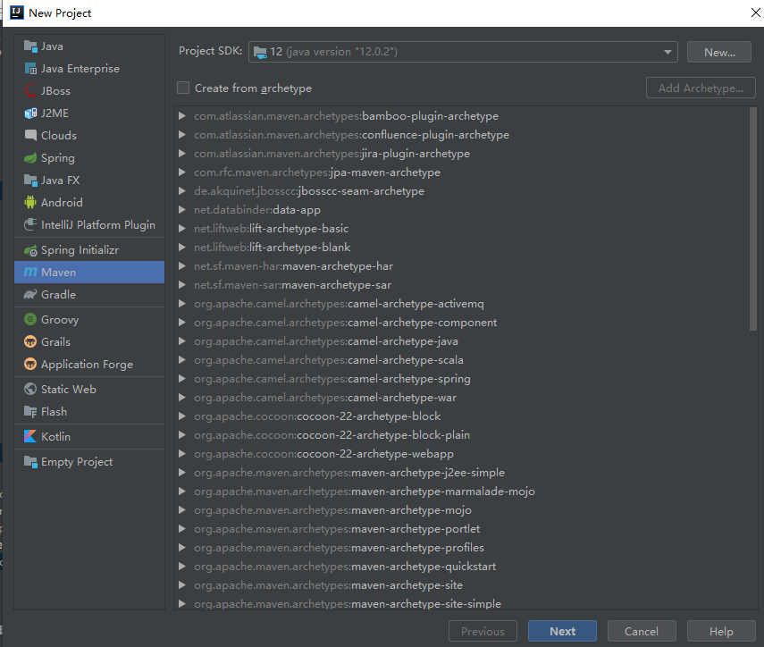

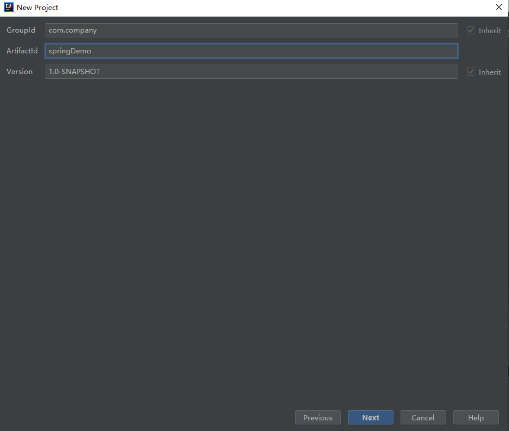

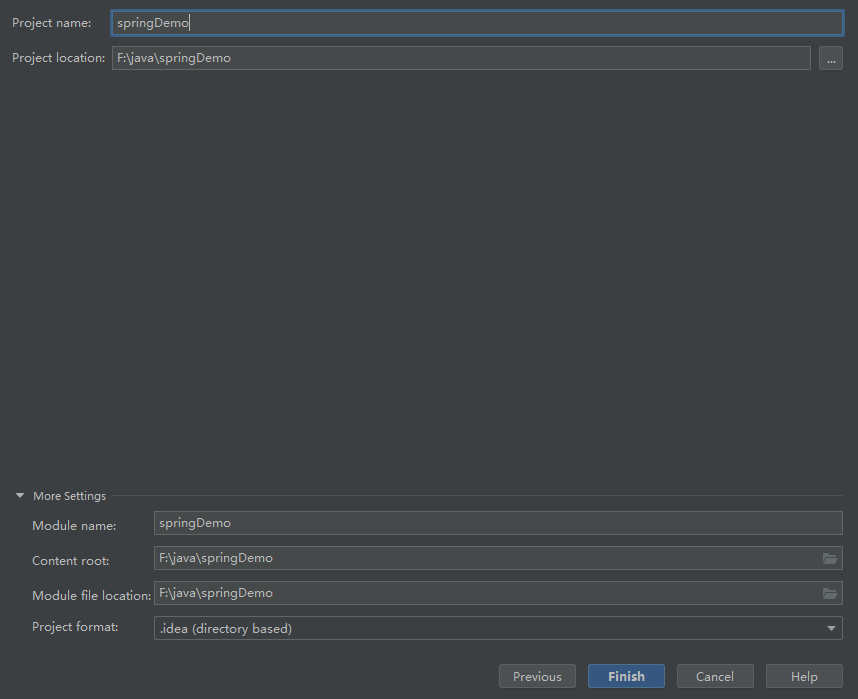

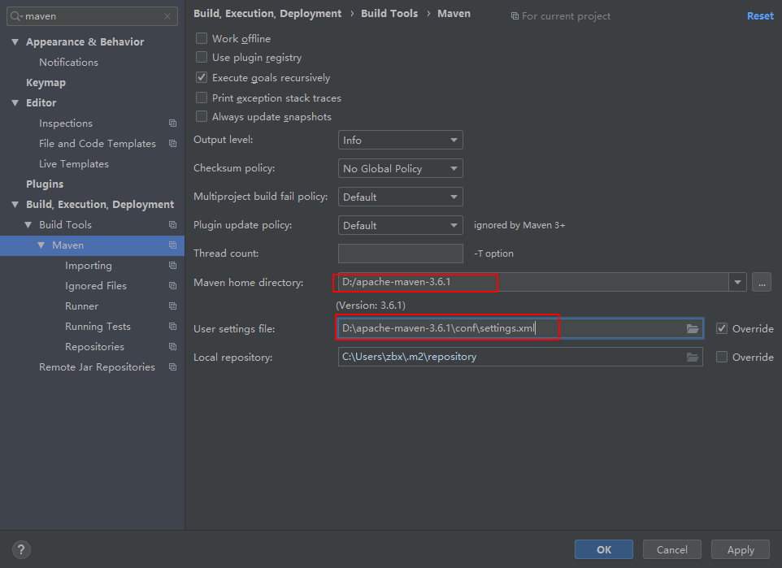

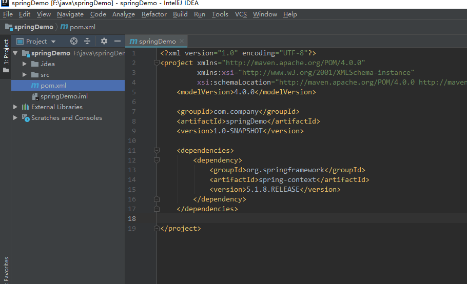

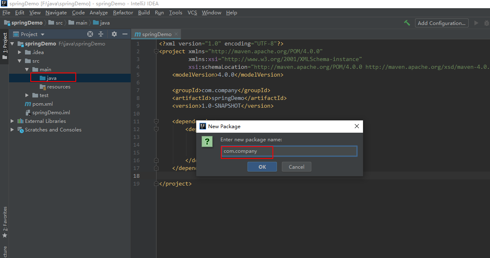

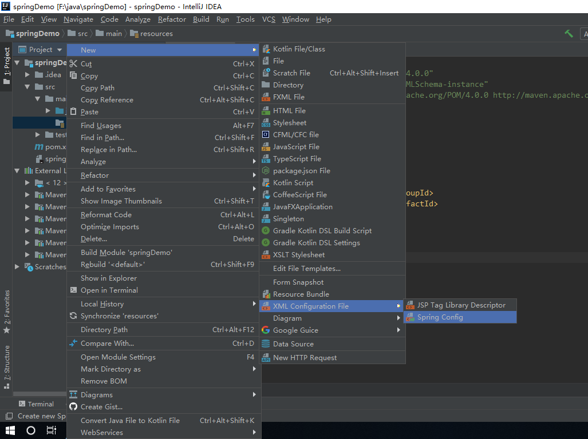
在项目资源目录下新建Spring配置文件application.xml

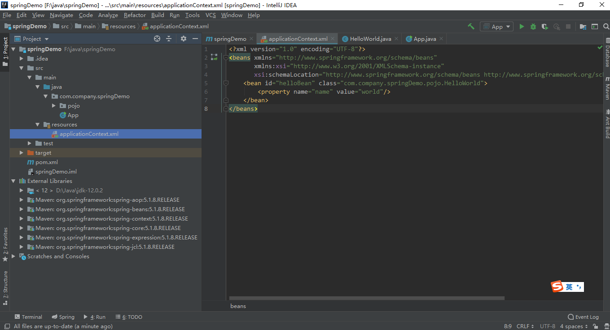

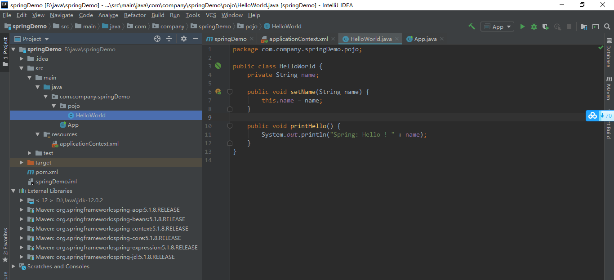

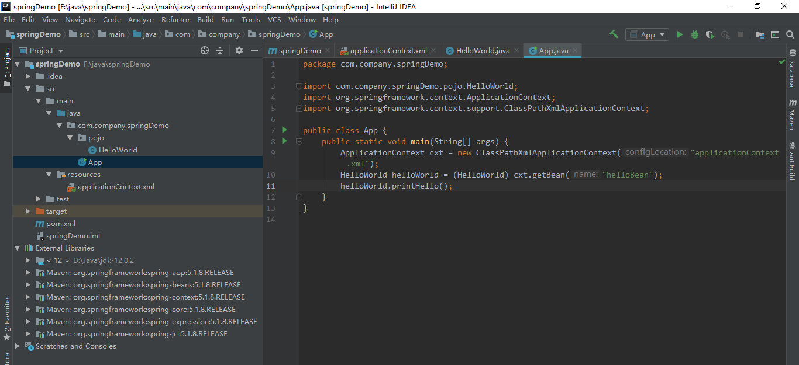

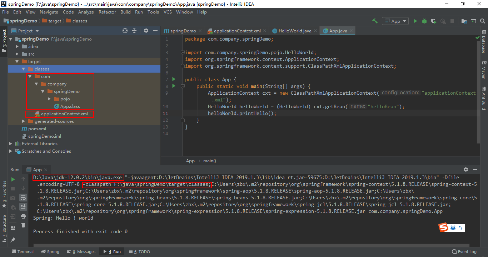
项目资源目录`${basedir}/src/main/resource`下的内容，会直接输出到编译输出目录`${basedir}/target/classes`中。

执行java应用程序，即用java命令执行编译后的`.class`文件，可以看出`${basedir}/src/main/java`和`${basedir}/src/main/resources`编译输出的内容都将成为classpath一部分，此外各种依赖jar包的路径也是classpath一部分

```sh
-classpath F:\java\springDemo\target\classes;C:\Users\zbx\.m2\repository\org\springframework\spring-context\5.1.8.RELEASE\spring-context-5.1.8.RELEASE.jar;C:\Users\zbx\.m2\repository\org\springframework\spring-aop\5.1.8.RELEASE\spring-aop-5.1.8.RELEASE.jar;C:\Users\zbx\.m2\repository\org\springframework\spring-beans\5.1.8.RELEASE\spring-beans-5.1.8.RELEASE.jar;C:\Users\zbx\.m2\repository\org\springframework\spring-core\5.1.8.RELEASE\spring-core-5.1.8.RELEASE.jar;C:\Users\zbx\.m2\repository\org\springframework\spring-jcl\5.1.8.RELEASE\spring-jcl-5.1.8.RELEASE.jar;C:\Users\zbx\.m2\repository\org\springframework\spring-expression\5.1.8.RELEASE\spring-expression-5.1.8.RELEASE.jar
```
