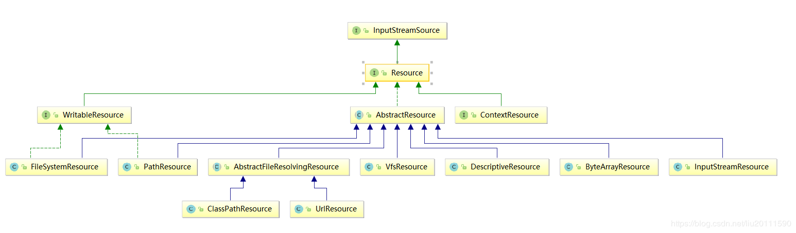

# 资源resource

参考：
- [Spring中Resource（资源）的获取](https://www.cnblogs.com/deityjian/p/11487644.html)
- [spring之Resource加载](https://blog.csdn.net/liu20111590/article/details/89180320)

resource位于Spring的core中。

